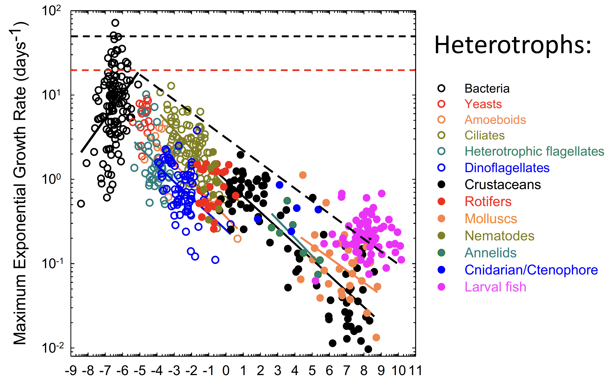
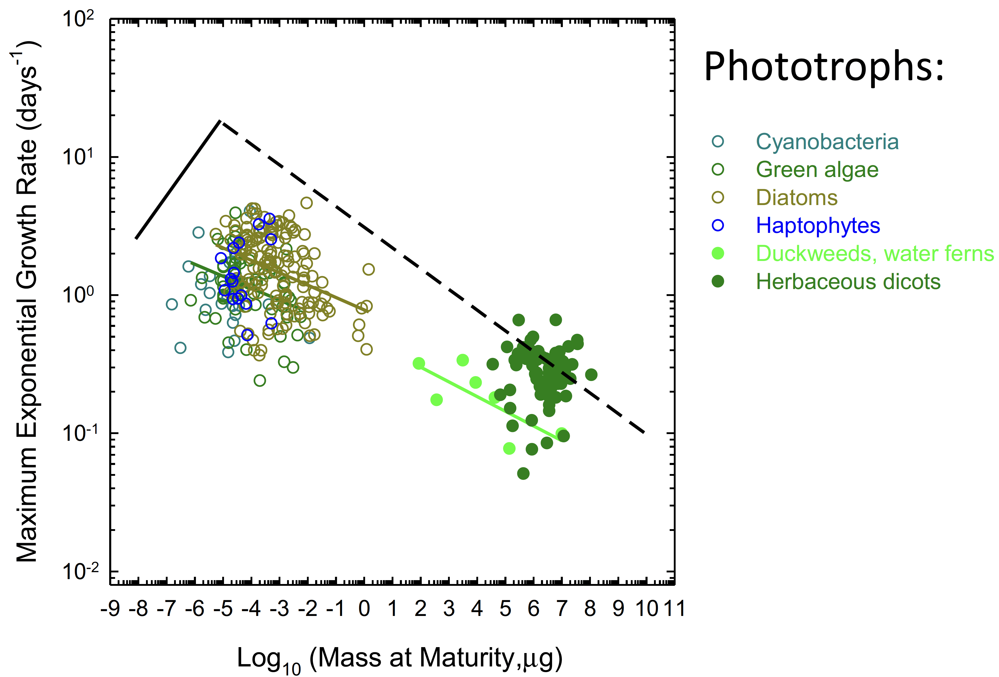
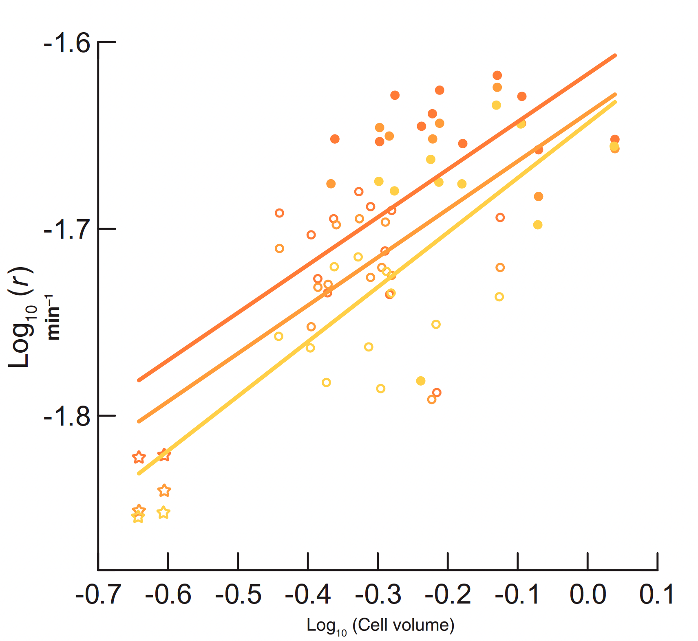
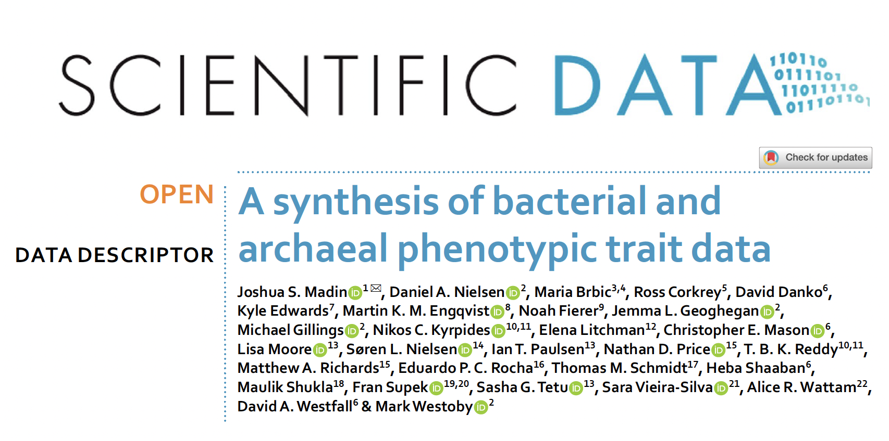
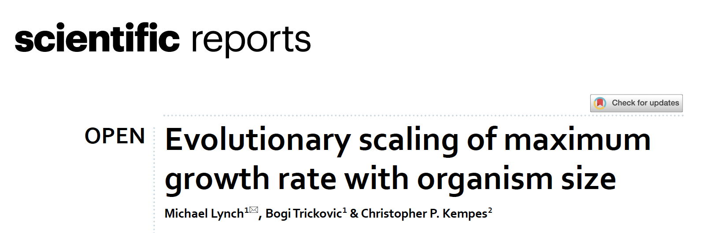

```{r setup, include=FALSE}


library(ape)
require(emo)
library(extrafont)
library(geiger)
require(icons)
library(kableExtra)
require(knitr)
library(lattice)
library(nlme)
library(phytools)
library(raster)
library(rsvg)
library(scales)
library(shape)
library(rphylopic)
library(vioplot)
require(xaringan)
require(xaringanExtra)

```


```{r, include = FALSE}

options(htmltools.dir.version = FALSE)
# preset code chunk options
knitr::opts_chunk$set(dpi = 300,            # ensures high resolution images
                      echo = FALSE,         # FALSE: code chunks don't show
                      warning = FALSE,      # FALSE: suppresses warning messages
                      error = FALSE,       # FALSE: Suppresses error messages
                      results = 'hide',
                      fig.align = "center")

```


```{css, echo=FALSE}


pre {
  max-height: 200px;
  overflow-y: visible;
  overflow-x: visible;
  scrollbar-color: #007 #bada55;
}

pre[class] {
  max-height: 100px;
}


.scroll-100 {
  max-height: 100px;
  overflow-y: visible;

}


```


```{r, xaringan-slide-tone, include = FALSE}

xaringanExtra::use_slide_tone()

```

# Acknowledgment


.pull-left[
<center>
<br>
Dr Kerry Geiler-Samerotte
</center>
]

.pull-right[
<center>
<br>
Dr Michael Lynch
</center>
]


---

# Outline

<br/>


## Relationship between growth and size

- Theoretical predictions
- Empirical support

--

## Methods

- Data source
- Description of variables

--

## Current evidence

- Striking observations
- Analysis of findings


---
class: center, middle
background-image: url("imgs/bg-img.png")

# Evolution of growth and size

---

# Relationship between growth and size

## Metabolism governs the rate at which organisms transform energy into biological work and growth

---

# Relationship between growth and size

## Metabolism governs the rate at which organisms transform energy into biological work and growth

.pull-left[
<center>

</center>
]

--

.pull-right[
<br><br>
<center>

</center>
]


---

# Prokaryotes defy theoretical predictions

<br>

.pull-left[
<center>

</center>
]
.pull-right[
<center>

</center>
]


[Lynch et al., (2022)](https://www.nature.com/articles/s41598-022-23626-7)


---

# Prokaryotes defy theoretical predictions

<br>

.pull-left[
<center>
<br>
</center>

[Marshall et al., (2022)](https://www.pnas.org/doi/full/10.1073/pnas.2200713119)

]

--

.pull-right[
<center>

</center>
]

---

# Methods

.pull-left[
<center>
<br>

</center>
]


.pull-right[
<center>
<br>

</center>
]

---

# Methods

.pull-left[

<br>
<ul>
 <li>
 Minimum doubling time
 </li>$$(log_{10} h)$$
 <li>
 Cell volume
 </li>$$(log_{10} \mu m^3)$$
 <li>
 Cell diameter
 </li>$$(log_{10} \mu m)$$
</ul>

]


.pull-right[

<center>

```{r, out.width='90%'}

tree <- read.tree("../spp.tree.nwk")

data <- read.csv("../condensed_traits_NCBI.csv")

vol <- read.csv("../cell_volume.csv")
str(vol)
head(vol)

spp.d1_lo <- data[!is.na(data$d1_lo), ]
spp.d1_up <- data[!is.na(data$d1_up), ]
spp.doubling <- data[!is.na(data$doubling_h), ]
spp.rRNA <- data[!is.na(data$rRNA16S_genes), ]
spp.tRNA <- data[!is.na(data$tRNA_genes), ]


tRNA <- aggregate(spp.tRNA$tRNA_genes, by = list(spp.tRNA$species), mean, na.action = na.rm)
rRNA <- aggregate(spp.rRNA$rRNA16S_genes, by = list(spp.rRNA$species), mean, na.action = na.rm)
d1_up <- aggregate(spp.d1_up$d1_up, by = list(spp.d1_up$species), mean, na.action = na.rm)
d1_lo <- aggregate(spp.d1_lo$d1_lo, by = list(spp.d1_lo$species), mean, na.action = na.rm)
doubling <- aggregate(spp.doubling$doubling_h, by = list(spp.doubling$species), mean, na.action = na.rm)
cell.vol <- aggregate(vol$volume, by = list(vol$species), mean)
str(cell.vol)


dim(tRNA)
names(tRNA) <- c("species", "tRNA")
dim(rRNA)
names(rRNA) <- c("species", "rRNA")
dim(d1_up)
names(d1_up) <- c("species", "d1_up")
dim(d1_lo)
names(d1_lo) <- c("species", "d1_lo")
dim(doubling)
names(doubling) <- c("species", "doubling_h")
dim(cell.vol)
names(cell.vol) <- c("species", "volume")


## Relationship between diameter and volume

d1_up <- aggregate(spp.d1_up$d1_up, by = list(spp.d1_up$species), mean, na.action = na.rm)
cell.vol <- aggregate(vol$volume, by = list(vol$species), mean)


names(d1_up) <- c("species", "d1_up")
names(cell.vol) <- c("species", "volume")


d1_up$species <- gsub("[[:punct:]]", "", d1_up$species)
d1_up$species <- gsub(" ", "_", d1_up$species)
cell.vol$species <- gsub(" ", "_", cell.vol$species)

di.vol <- merge(cell.vol, d1_up, by = "species")

p.cor <- cor.test(log10(di.vol$volume), di.vol$d1_up, method = "pearson")


##png("figure3.png", height = 7, width = 7, units = "in", res = 360)


plot(log10(volume) ~ d1_up, data = di.vol, pch = 16, las = 1, ylab = expression(paste("Cell volume ", log[10], sep = " ")(mu*m^3)), xlab = expression(paste("Cell diameter ", log[10], sep = " ")(mu*m)), mgp = c(2.6, 1, 0), type = "n", cex = 1.3)

grid(nx = NULL, ny = NULL, col = alpha("lightgray", 0.5), lwd = 1, lty = 2)

par(new = TRUE)

plot(log10(volume) ~ d1_up, data = di.vol, pch = 16, las = 1, ylab = "", xlab = "", mgp = c(2.6, 1, 0), type = "p", axes = FALSE, cex = 1.3)


abline(lm(log10(di.vol$volume) ~ di.vol$d1_up), lwd = 2.5)
legend(x = 0.1, y = 2.3, legend = expression("R"^2==~0.877), bty = "n", cex = 1.1)
legend(x = 0.1, y = 2.06, legend = expression(p==~0.001), bty = "n", cex = 1.1)

```
</center>

]

---
class: center, middle
background-image: url("imgs/cells.png")
background-size: cover


# Results

# Growth v Cell Size

---

```{r, include = FALSE}


## Cell Volume


doubling <- aggregate(spp.doubling$doubling_h, by = list(spp.doubling$species), mean, na.action = na.rm)
cell.vol <- aggregate(vol$volume, by = list(vol$species), mean)
str(cell.vol)

dim(doubling)
names(doubling) <- c("species", "doubling_h")
dim(cell.vol)
names(cell.vol) <- c("species", "volume")


obj <- rep()
for(i in cell.vol$species){
    kingdom <- data$superkingdom[data$species == i][1]
    obj <- c(obj, kingdom)
}

cell.vol$kingdom <- obj
cell.vol$kingdom[11] <- "Bacteria"

doubling$species <- gsub("[[:punct:]]", "", doubling$species)
doubling$species <- gsub(" ", "_", doubling$species)
cell.vol$species <- gsub(" ", "_", cell.vol$species)

v.dat <- merge(cell.vol, doubling, by = "species")
v.dat <- v.dat[!v.dat$species == "Sphingopyxis_alaskensis", ] ## possible outlier
v.dat <- v.dat[!v.dat$species == "Anabaena_cylindrica", ] ## possible outlier
v.dat <- v.dat[!v.dat$species == "Haloferax_volcanii", ] ## possible outlier
v.dat <- v.dat[!v.dat$species == "Azotobacter_chroococcum", ] ## possible outlier
rownames(v.dat) <- v.dat$species

vol.tree <- read.tree("vol.spp.nwk")
vol.tree <- force.ultrametric(vol.tree)

check <- name.check(vol.tree, v.dat)
rm_phy <- check$tree_not_data
rm_dat <- check$data_not_tree
tree.vol <- drop.tip(vol.tree, rm_phy)

vol.dat <- subset(v.dat, subset = v.dat$species %in% tree.vol$tip, select = names(v.dat))
name.check(tree.vol, vol.dat)
str(vol.dat)

```

.pull-left[

```{r}


#png("tree.png", height = 7, width = 7, units = "in", res = 360)


col.br <- setNames(c("purple", "orange"), c("Archaea", "Bacteria"))

plotTree(tree.vol, ftype = "i", lwd = 3.5, mar = c(3.5, 1, 1, 3))

par(new = TRUE, col = "transparent")

painted <- paintSubTree(tree.vol, 52, "Archaea" ,"0")
plotSimmap(painted, col.br, ftype = "i", lwd = 3.5, mar = c(3.5, 1, 1, 3))

par(new = TRUE, col = "transparent")

painted <- paintSubTree(tree.vol, 31, "Bacteria")
plotSimmap(painted, col.br, ftype = "i", lwd = 3.5, mar = c(3.5, 1, 1, 3))

par(new = TRUE, col = "black")

legend("bottomleft", legend = c("Archaea", "Bacteria"), lwd = 3.5, col = col.br, bty = "n")
axisPhylo(1, line = -0.1)
mtext("Time (mya)", side = 1, line = 2, at = 2000)


obj <- get("last_plot.phylo", envir = .PlotPhyloEnv)
x2 <- runif(100, obj$x.lim[2] + 10, obj$x.lim[2] + 50)
spp <- gsub("(_).*","", tree.vol$tip.label)[-c(3, 6, 9, 10, 12, 14, 16, 18, 21, 24, 28)]
spp[7] <- "Cyanobacteria"
spp[8] <- "Mycoplasma_genitalium"
spp[10] <- "Pleurocapsa fuliginosa"


col.fill <- c(rep("orange", 13), rep("purple", 7))
col.bor <- c(rep("black", 13), rep("red", 7))
idx <- 1
for(i in spp){
    x2
    uuid <- get_uuid(name = i, n = 1)
    img <- get_phylopic(uuid = uuid)
    nodes <- sapply(i, grep, x = tree.vol$tip.label)
    for(j in nodes){
        add_phylopic_base(img = img, x = sample(x2, 1), y = j, ysize = 1, color = col.bor[idx], fill = col.fill[idx])

    }
    idx = idx + 1
}

uuid <- get_uuid(name = "Chroococcus turgidus", n = 1)
img <- get_phylopic(uuid = uuid)
add_phylopic_base(img = img, x = 7400, y = 10, ysize = 1, color = "black", fill = "orange")

uuid <- get_uuid(name = "Pleurocapsa fuliginosa", n = 1)
img <- get_phylopic(uuid = uuid)
add_phylopic_base(img = img, x = 7400, y = 17, ysize = 1, color = "black", fill = "orange")

uuid <- get_uuid(name = "Fimbriimonas ginsengisoli", n = 1)
img <- get_phylopic(uuid = uuid)
add_phylopic_base(img = img, x = 7400, y = 11.5, ysize = 1, color = alpha("black", 0.1), fill = "orange")


#dev.off()

```


```{r, include = FALSE, fig.show = 'hide'}

## Optimum temp

spp.d1_up <- data[!is.na(data$d1_up), ]
spp.temp.op <- data[!is.na(data$optimum_tmp), ]
spp.growth_temp <- data[!is.na(data$growth_tmp), ]
spp.doubling <- data[!is.na(data$doubling_h), ]

d1_up <- aggregate(spp.d1_up$d1_up, by = list(spp.d1_up$species), mean, na.action = na.rm)
doubling <- aggregate(spp.doubling$doubling_h, by = list(spp.doubling$species), mean, na.action = na.rm)
temp.op <- aggregate(spp.temp.op$optimum_tmp, by = list(spp.temp.op$species), mean, na.action = na.rm)
growth_temp <- aggregate(spp.growth_temp$growth_tmp, by = list(spp.growth_temp$species), mean, na.action = na.rm)

dim(doubling)
dim(doubling)
names(doubling) <- c("species", "doubling_h")
dim(d1_up)
names(d1_up) <- c("species", "d1_up")
dim(temp.op)
names(temp.op) <- c("species", "tmp.op")
dim(growth_temp)
names(growth_temp) <- c("species", "growth_tmp")


mrg.tmp <- merge(temp.op, growth_temp, by = "species")
str(mrg.tmp)


mrg.op.tmp <- mrg.tmp[mrg.tmp$growth_tmp == mrg.tmp$tmp.op, ]
mrg.upper.tmp <- mrg.tmp[mrg.tmp$growth_tmp > mrg.tmp$tmp.op, ]
mrg.lower.tmp <- mrg.tmp[mrg.tmp$growth_tmp < mrg.tmp$tmp.op, ]

mrg.tmp.op <- merge(mrg.op.tmp, d1_up, by = "species")
str(mrg.tmp.op)

mrg.tmp.upper <- merge(mrg.upper.tmp, d1_up, by = "species")
str(mrg.tmp.upper)

mrg.tmp.lower <- merge(mrg.lower.tmp, d1_up, by = "species")
str(mrg.tmp.lower)

mrg.tmp.op.growth <- merge(mrg.tmp.op, doubling, by = "species")
str(mrg.tmp.op.growth)

mrg.tmp.upper.growth <- merge(mrg.tmp.upper, doubling, by = "species")
str(mrg.tmp.upper.growth)

mrg.tmp.lower.growth <- merge(mrg.tmp.lower, doubling, by = "species")
str(mrg.tmp.lower.growth)


obj <- rep()
for(i in mrg.tmp.op$species){
    kingdom <- unique(data$superkingdom[data$species == i])
    obj <- c(obj, kingdom)
}

mrg.tmp.op$kingdom <- obj
head(mrg.tmp.op)

mrg.tmp.op$species <- gsub("[[:punct:]]", "", mrg.tmp.op$species)
mrg.tmp.op$species <- gsub(" ", "_", mrg.tmp.op$species)
rownames(mrg.tmp.op) <- mrg.tmp.op$species
head(mrg.tmp.op$species)

check <- name.check(tree, mrg.tmp.op)
rm_phy <- check$tree_not_data
rm_dat <- check$data_not_tree
tree.tmp.op <- drop.tip(tree, rm_phy)

tmp.op.dat <- subset(mrg.tmp.op, subset = mrg.tmp.op$species %in% tree.tmp.op$tip, select = names(mrg.tmp.op))
name.check(tree.tmp.op, tmp.op.dat)


obj <- rep()
for(i in mrg.tmp.upper$species){
    kingdom <- unique(data$superkingdom[data$species == i])
    obj <- c(obj, kingdom)
}

mrg.tmp.upper$kingdom <- obj
head(mrg.tmp.upper)

mrg.tmp.upper$species <- gsub("[[:punct:]]", "", mrg.tmp.upper$species)
mrg.tmp.upper$species <- gsub(" ", "_", mrg.tmp.upper$species)
rownames(mrg.tmp.upper) <- mrg.tmp.upper$species
head(mrg.tmp.upper$species)

check <- name.check(tree, mrg.tmp.upper)
rm_phy <- check$tree_not_data
rm_dat <- check$data_not_tree
tree.tmp.upper <- drop.tip(tree, rm_phy)

tmp.upper.dat <- subset(mrg.tmp.upper, subset = mrg.tmp.upper$species %in% tree.tmp.upper$tip, select = names(mrg.tmp.upper))
name.check(tree.tmp.upper, tmp.upper.dat)


obj <- rep()
for(i in mrg.tmp.lower$species){
    kingdom <- unique(data$superkingdom[data$species == i])
    obj <- c(obj, kingdom)
}

mrg.tmp.lower$kingdom <- obj
head(mrg.tmp.lower)

mrg.tmp.lower$species <- gsub("[[:punct:]]", "", mrg.tmp.lower$species)
mrg.tmp.lower$species <- gsub(" ", "_", mrg.tmp.lower$species)
rownames(mrg.tmp.lower) <- mrg.tmp.lower$species
head(mrg.tmp.lower$species)

check <- name.check(tree, mrg.tmp.lower)
rm_phy <- check$tree_not_data
rm_dat <- check$data_not_tree
tree.tmp.lower <- drop.tip(tree, rm_phy)

tmp.lower.dat <- subset(mrg.tmp.lower, subset = mrg.tmp.lower$species %in% tree.tmp.lower$tip, select = names(mrg.tmp.lower))
name.check(tree.tmp.lower, tmp.lower.dat)


## Growth


obj <- rep()
for(i in mrg.tmp.op.growth$species){
    kingdom <- unique(data$superkingdom[data$species == i])
    obj <- c(obj, kingdom)
}

mrg.tmp.op.growth$kingdom <- obj
head(mrg.tmp.op.growth)

mrg.tmp.op.growth$species <- gsub("[[:punct:]]", "", mrg.tmp.op.growth$species)
mrg.tmp.op.growth$species <- gsub(" ", "_", mrg.tmp.op.growth$species)
rownames(mrg.tmp.op.growth) <- mrg.tmp.op.growth$species
head(mrg.tmp.op.growth$species)

check <- name.check(tree, mrg.tmp.op.growth)
rm_phy <- check$tree_not_data
rm_dat <- check$data_not_tree
tree.tmp.op.growth <- drop.tip(tree, rm_phy)

tmp.op.dat.growth <- subset(mrg.tmp.op.growth, subset = mrg.tmp.op.growth$species %in% tree.tmp.op.growth$tip, select = names(mrg.tmp.op.growth))
name.check(tree.tmp.op.growth, tmp.op.dat.growth)


obj <- rep()
for(i in mrg.tmp.upper.growth$species){
    kingdom <- unique(data$superkingdom[data$species == i])
    obj <- c(obj, kingdom)
}

mrg.tmp.upper.growth$kingdom <- obj
head(mrg.tmp.upper.growth)

mrg.tmp.upper.growth$species <- gsub("[[:punct:]]", "", mrg.tmp.upper.growth$species)
mrg.tmp.upper.growth$species <- gsub(" ", "_", mrg.tmp.upper.growth$species)
rownames(mrg.tmp.upper.growth) <- mrg.tmp.upper.growth$species
head(mrg.tmp.upper.growth$species)

check <- name.check(tree, mrg.tmp.upper.growth)
rm_phy <- check$tree_not_data
rm_dat <- check$data_not_tree
tree.tmp.upper.growth <- drop.tip(tree, rm_phy)

tmp.upper.dat.growth <- subset(mrg.tmp.upper.growth, subset = mrg.tmp.upper.growth$species %in% tree.tmp.upper.growth$tip, select = names(mrg.tmp.upper.growth))
name.check(tree.tmp.upper.growth, tmp.upper.dat.growth)


obj <- rep()
for(i in mrg.tmp.lower.growth$species){
    kingdom <- unique(data$superkingdom[data$species == i])
    obj <- c(obj, kingdom)
}

mrg.tmp.lower.growth$kingdom <- obj
head(mrg.tmp.lower.growth)

mrg.tmp.lower.growth$species <- gsub("[[:punct:]]", "", mrg.tmp.lower.growth$species)
mrg.tmp.lower.growth$species <- gsub(" ", "_", mrg.tmp.lower.growth$species)
rownames(mrg.tmp.lower.growth) <- mrg.tmp.lower.growth$species
head(mrg.tmp.lower.growth$species)

check <- name.check(tree, mrg.tmp.lower.growth)
rm_phy <- check$tree_not_data
rm_dat <- check$data_not_tree
tree.tmp.lower.growth <- drop.tip(tree, rm_phy)

tmp.lower.dat.growth <- subset(mrg.tmp.lower.growth, subset = mrg.tmp.lower.growth$species %in% tree.tmp.lower.growth$tip, select = names(mrg.tmp.lower.growth))
name.check(tree.tmp.lower.growth, tmp.lower.dat.growth)


```

]


```{r, fig.show = 'hide'}


tmp.lower.dat <- tmp.lower.dat[tmp.lower.dat$d1_up < 4, ] ## Removing potential outliers
tmp.op.dat <- tmp.op.dat[tmp.op.dat$d1_up < 4, ] ## Removing potential outliers
tmp.upper.dat <- tmp.upper.dat[tmp.upper.dat$d1_up < 4, ] ## Removing potential outliers


#png("figure4.png", height = 7, width = 7, units = "in", res = 360)


layout(matrix(c(1, 1, 2, 2, 3, 3,
                1, 1, 2, 2, 3, 3,
                4, 4, 5, 5, 6, 6,
                4, 4, 5, 5, 6, 6), nrow = 4, ncol = 6, byrow = TRUE))


## lower


tmp.lower.dat <- tmp.lower.dat[tmp.lower.dat$d1_up < 4, ] ## Removing potential outliers


model6.1 <- lm(d1_up ~ log10(tmp.op), data = tmp.lower.dat)


## IC

SSX <- sum(round((log10(tmp.lower.dat$tmp.op) - mean(log10(tmp.lower.dat$tmp.op)))^2), 2)
s2 <- var(tmp.lower.dat$d1_up)
n <- length(tmp.lower.dat$d1_up)
x <- seq(min(log10(tmp.lower.dat$tmp.op)), max(log10(tmp.lower.dat$tmp.op)), length = 30)
m.x <- mean(round(log10(tmp.lower.dat$tmp.op), 1))
se <- sqrt(s2*((1/n) + (((x - m.x)^2)/SSX)))
is <- qt(0.975, df = n - 2)
ii <- qt(0.025, df = n - 2)
ic.s <- se*is
ic.i <- se*ii
upper.i <- (coef(model6.1)[1] + coef(model6.1)[2]*x) + ic.s
lower.i <- (coef(model6.1)[1] + coef(model6.1)[2]*x) + ic.i

par(mar = c(6.4, 4, 2, 0), mgp = c(2.8, 1, 0))
    
plot(d1_up ~ log10(tmp.op), data = tmp.lower.dat, ylab = expression(paste("Cell diameter ", log[10], sep = " ")(mu*m)), xlab = expression(paste("Lower temperature")~log[10]~("\u00B0C")), las = 1, pch = 21, cex = 1.2, type = "n")

grid(nx = NULL, ny = NULL, col = alpha("lightgray", 0.5), lwd = 1, lty = 2)

par(new = TRUE)

cols <- setNames(c("purple", "orange"), levels(as.factor(tmp.lower.dat$kingdom)))

plot(d1_up ~ log10(tmp.op), data = tmp.lower.dat, xlab = "", ylab = "", las = 1, pch = 21, col = cols[tmp.lower.dat$kingdom], bg = cols[tmp.lower.dat$kingdom], cex = 1.1, axes = FALSE)

#lines(x = x, y = (coef(model6.1)[1] + coef(model6.1)[2]*x), lwd = 2, col = "black")
#polygon(c(rev(x), x), c(rev(lower.i), upper.i), border = FALSE, col = alpha("gold", 0.3))

legend("topleft", legend = levels(as.factor((tmp.lower.dat$kingdom))), pch = 16, col = c("purple", "orange"), bg = c("purple", "orange"), bty = "n", cex = 0.8)
legend("topright", legend = paste("n = ", length(tmp.lower.dat$species)), bty = "n", cex = 0.8)

mtext("A", side = 2, line = 2.6, at = 3.8, las = 1, font = 2)


## Cell size and temp opt

tmp.op.dat <- tmp.op.dat[tmp.op.dat$d1_up < 4, ] ## Removing potential outliers

#model6 <- gls(d1_up ~ log10(tmp.op), correlation = corBrownian(phy = tree.tmp, form = ~species), data = tmp.dat, method = "ML")

#model6 <- lm(d1_up ~ log10(tmp.op), data = tmp.dat)
model6 <- lm(d1_up ~ log10(tmp.op), data = tmp.op.dat)


## IC

SSX <- sum(round((log10(tmp.op.dat$tmp.op) - mean(log10(tmp.op.dat$tmp.op)))^2), 2)
s2 <- var(tmp.op.dat$d1_up)
n <- length(tmp.op.dat$d1_up)
x <- seq(min(log10(tmp.op.dat$tmp.op)), max(log10(tmp.op.dat$tmp.op)), length = 30)
m.x <- mean(round(log10(tmp.op.dat$tmp.op), 1))
se <- sqrt(s2*((1/n) + (((x - m.x)^2)/SSX)))
is <- qt(0.975, df = n - 2)
ii <- qt(0.025, df = n - 2)
ic.s <- se*is
ic.i <- se*ii
upper.i <- (coef(model6)[1] + coef(model6)[2]*x) + ic.s
lower.i <- (coef(model6)[1] + coef(model6)[2]*x) + ic.i


par(mar = c(6.4, 2.3, 2, 0.1))

plot(d1_up ~ log10(tmp.op), data = tmp.op.dat, ylab = " ",  xlab = expression(paste("Optimum temperature")~log[10]~("\u00B0C")), las = 1, pch = 21, cex = 1.2, type = "n")

grid(nx = NULL, ny = NULL, col = alpha("lightgray", 0.5), lwd = 1, lty = 2)

par(new = TRUE)

cols <- setNames(c("purple", "orange"), levels(as.factor(tmp.op.dat$kingdom)))

plot(d1_up ~ log10(tmp.op), data = tmp.op.dat, xlab = "", ylab = "", las = 1, pch = 21, col = cols[tmp.op.dat$kingdom], bg = cols[tmp.op.dat$kingdom], cex = 1.1, axes = FALSE)

#lines(x = x, y = (coef(model6)[1] + coef(model6)[2]*x), lwd = 2, col = "black")
#polygon(c(rev(x), x), c(rev(lower.i), upper.i), border = FALSE, col = alpha("gold", 0.3))

legend("topleft", legend = levels(as.factor((tmp.op.dat$kingdom))), pch = 16, col = c("purple", "orange"), bg = c("purple", "orange"), bty = "n", cex = 0.8)
legend(x = 0.7, y = 3.07, legend = paste("n = ", length(tmp.op.dat$species)), bty = "n", cex = 0.8)


## upper


tmp.upper.dat <- tmp.upper.dat[tmp.upper.dat$d1_up < 4, ] ## Removing potential outliers


model6.3 <- lm(d1_up ~ log10(tmp.op), data = tmp.upper.dat)


## IC

SSX <- sum(round((log10(tmp.upper.dat$tmp.op) - mean(log10(tmp.upper.dat$tmp.op)))^2), 2)
s2 <- var(tmp.upper.dat$d1_up)
n <- length(tmp.upper.dat$d1_up)
x <- seq(min(log10(tmp.upper.dat$tmp.op)), max(log10(tmp.upper.dat$tmp.op)), length = 30)
m.x <- mean(round(log10(tmp.upper.dat$tmp.op), 1))
se <- sqrt(s2*((1/n) + (((x - m.x)^2)/SSX)))
is <- qt(0.975, df = n - 2)
ii <- qt(0.025, df = n - 2)
ic.s <- se*is
ic.i <- se*ii
upper.i <- (coef(model6.3)[1] + coef(model6.3)[2]*x) + ic.s
lower.i <- (coef(model6.3)[1] + coef(model6.3)[2]*x) + ic.i


par(mar = c(6.4, 2.3, 2, 0.2))

plot(d1_up ~ log10(tmp.op), data = tmp.upper.dat, ylab = " ", xlab = expression(paste("Upper temperature")~log[10]~("\u00B0C")), las = 1, pch = 21, cex = 1.2, type = "n")

grid(nx = NULL, ny = NULL, col = alpha("lightgray", 0.5), lwd = 1, lty = 2)

par(new = TRUE)

cols <- setNames(c("purple", "orange"), levels(as.factor(tmp.upper.dat$kingdom)))

plot(d1_up ~ log10(tmp.op), data = tmp.upper.dat, xlab = "", ylab = "", las = 1, pch = 21, col = cols[tmp.upper.dat$kingdom], bg = cols[tmp.upper.dat$kingdom], cex = 1.1, axes = FALSE)

lines(x = x, y = (coef(model6.3)[1] + coef(model6.3)[2]*x), lwd = 2.5, col = "black")
polygon(c(rev(x), x), c(rev(lower.i), upper.i), border = FALSE, col = alpha("gold", 0.3))

legend("topleft", legend = levels(as.factor((tmp.upper.dat$kingdom))), pch = 16, col = c("purple", "orange"), bg = c("purple", "orange"), bty = "n", cex = 0.8)
legend(x = 0.6, y = 3, legend = paste("n = ", length(tmp.upper.dat$species)), bty = "n", cex = 0.8)


## GROWTH


## lower


model7.1 <- lm(log10(doubling_h) ~ log10(tmp.op), data = tmp.lower.dat.growth)

## IC

SSX <- sum(round((log10(tmp.lower.dat.growth$tmp.op) - mean(log10(tmp.lower.dat.growth$tmp.op)))^2), 2)
s2 <- var(log10(tmp.lower.dat.growth$doubling_h))
n <- length(log10(tmp.lower.dat.growth$doubling_h))
x <- seq(min(log10(tmp.lower.dat.growth$tmp.op)), max(log10(tmp.lower.dat.growth$tmp.op)), length = 30)
m.x <- mean(round(log10(tmp.lower.dat.growth$tmp.op), 1))
se <- sqrt(s2*((1/n) + (((x - m.x)^2)/SSX)))
is <- qt(0.975, df = n - 2)
ii <- qt(0.025, df = n - 2)
ic.s <- se*is
ic.i <- se*ii
upper.i <- (coef(model7.1)[1] + coef(model7.1)[2]*x) + ic.s
lower.i <- (coef(model7.1)[1] + coef(model7.1)[2]*x) + ic.i

par(mar = c(6.4, 4, 2, 0), mgp = c(2.8, 1, 0))

plot(log10(doubling_h) ~ log10(tmp.op), data = tmp.lower.dat.growth, ylab = expression(paste("Doubling ", log[10], sep = " ")(h)), xlab = expression(paste("Lower temperature")~log[10]~("\u00B0C")), las = 1, pch = 21, bg = alpha("black", 0.3), cex = 1.2, type = "n")

grid(nx = NULL, ny = NULL, col = alpha("lightgray", 0.5), lwd = 1, lty = 2)

par(new = TRUE)

cols3 <- c("purple", "orange")[as.numeric(as.factor(tmp.lower.dat.growth$kingdom))]

plot(log10(doubling_h) ~ log10(tmp.op), data = tmp.lower.dat.growth, xlab = "", ylab = "", las = 1, pch = 21, col = cols3, bg = cols3, cex = 1.1, axes = FALSE)

lines(x = x, y = (coef(model7.1)[1] + coef(model7.1)[2]*x), lty = 2, lwd = 2.5, col = "black")
polygon(c(rev(x), x), c(rev(lower.i), upper.i), border = FALSE, col = alpha("gold", 0.3))

legend("bottomleft", legend = levels(as.factor((tmp.lower.dat.growth$kingdom))), pch = 16, col = c("purple", "orange"), bg = c("purple", "orange"), bty = "n", cex = 0.8)

mtext("B", side = 2, line = 2.6, at = 3, las = 1, font = 2)
legend("topright", legend = paste("n = ", length(tmp.lower.dat.growth$species)), bty = "n", cex = 0.8)


## Doubling and optimum temp

#model7 <- gls(log(doubling_h) ~ log(tmp.op), correlation = corBrownian(phy = tree.tmp2, form = ~species), data = tmp.dat2, method = "ML")

model7 <- lm(log10(doubling_h) ~ log10(tmp.op), data = tmp.op.dat.growth)

## IC

SSX <- sum(round((log10(tmp.op.dat.growth$tmp.op) - mean(log10(tmp.op.dat.growth$tmp.op)))^2), 2)
s2 <- var(log10(tmp.op.dat.growth$doubling_h))
n <- length(log10(tmp.op.dat.growth$doubling_h))
x <- seq(min(log10(tmp.op.dat.growth$tmp.op)), max(log10(tmp.op.dat.growth$tmp.op)), length = 30)
m.x <- mean(round(log10(tmp.op.dat.growth$tmp.op), 1))
se <- sqrt(s2*((1/n) + (((x - m.x)^2)/SSX)))
is <- qt(0.975, df = n - 2)
ii <- qt(0.025, df = n - 2)
ic.s <- se*is
ic.i <- se*ii
upper.i <- (coef(model7)[1] + coef(model7)[2]*x) + ic.s
lower.i <- (coef(model7)[1] + coef(model7)[2]*x) + ic.i


par(mar = c(6.4, 2.3, 2, 0.1))

plot(log10(doubling_h) ~ log10(tmp.op), data = tmp.op.dat.growth, ylab = expression(paste("Doubling ", log[10], sep = " ")(h)), xlab = expression(paste("Optimum temperature")~log[10]~("\u00B0C")), las = 1, pch = 21, bg = alpha("black", 0.3), cex = 1.2, type = "n")

grid(nx = NULL, ny = NULL, col = alpha("lightgray", 0.5), lwd = 1, lty = 2)

par(new = TRUE)

cols3 <- c("purple", "orange")[as.numeric(as.factor(tmp.op.dat.growth$kingdom))]

plot(log10(doubling_h) ~ log10(tmp.op), data = tmp.op.dat.growth, xlab = "", ylab = "", las = 1, pch = 21, col = cols3, bg = cols3, cex = 1.1, axes = FALSE)

lines(x = x, y = (coef(model7)[1] + coef(model7)[2]*x), lty = 2, lwd = 2.5, col = "black")
polygon(c(rev(x), x), c(rev(lower.i), upper.i), border = FALSE, col = alpha("gold", 0.3))

legend("bottomleft", legend = levels(as.factor((tmp.op.dat.growth$kingdom))), pch = 16, col = c("purple", "orange"), bg = c("purple", "orange"), bty = "n", cex = 0.8)
legend(x = 0.92, y = 0.12, legend = paste("n = ", length(tmp.op.dat.growth$species)), bty = "n", cex = 0.8)


## upper


model7.2 <- lm(log10(doubling_h) ~ log10(tmp.op), data = tmp.upper.dat.growth)

## IC

SSX <- sum(round((log10(tmp.upper.dat.growth$tmp.op) - mean(log10(tmp.upper.dat.growth$tmp.op)))^2), 2)
s2 <- var(log10(tmp.upper.dat.growth$doubling_h))
n <- length(log10(tmp.upper.dat.growth$doubling_h))
x <- seq(min(log10(tmp.upper.dat.growth$tmp.op)), max(log10(tmp.upper.dat.growth$tmp.op)), length = 30)
m.x <- mean(round(log10(tmp.upper.dat.growth$tmp.op), 1))
se <- sqrt(s2*((1/n) + (((x - m.x)^2)/SSX)))
is <- qt(0.975, df = n - 2)
ii <- qt(0.025, df = n - 2)
ic.s <- se*is
ic.i <- se*ii
upper.i <- (coef(model7.2)[1] + coef(model7.2)[2]*x) + ic.s
lower.i <- (coef(model7.2)[1] + coef(model7.2)[2]*x) + ic.i

par(mar = c(6.4, 2.3, 2, 0.2))

plot(log10(doubling_h) ~ log10(tmp.op), data = tmp.upper.dat.growth, ylab = expression(paste("Doubling ", log[10], sep = " ")(h)), xlab = expression(paste("Upper temperature")~log[10]~("\u00B0C")), las = 1, pch = 21, bg = alpha("black", 0.3), cex = 1.2, type = "n")

grid(nx = NULL, ny = NULL, col = alpha("lightgray", 0.5), lwd = 1, lty = 2)

par(new = TRUE)

cols3 <- c("purple", "orange")[as.numeric(as.factor(tmp.upper.dat.growth$kingdom))]

plot(log10(doubling_h) ~ log10(tmp.op), data = tmp.upper.dat.growth, xlab = "", ylab = "", las = 1, pch = 21, col = cols3, bg = cols3, cex = 1.1, axes = FALSE)

lines(x = x, y = (coef(model7.2)[1] + coef(model7.2)[2]*x), lty = 2, lwd = 2.5, col = "black")
polygon(c(rev(x), x), c(rev(lower.i), upper.i), border = FALSE, col = alpha("gold", 0.3))

legend("bottomleft", legend = levels(as.factor((tmp.upper.dat.growth$kingdom))), pch = 16, col = c("purple", "orange"), bg = c("purple", "orange"), bty = "n", cex = 0.8)
legend(x = 0.6, y = -0.1, legend = paste("n = ", length(tmp.upper.dat.growth$species)), bty = "n", cex = 0.8)

#dev.off()


```

.pull-right[


```{r}


mod <- lm(log10(doubling_h) ~ log10(volume), data = v.dat)
#summary(mod)

pg.mod <- gls(log10(doubling_h) ~ log10(volume), correlation = corBrownian(phy = tree.vol, form = ~species), data = vol.dat, method = "ML")
#summary(pg.mod)


layout(matrix(c(0, 1, 1, 0,
                0, 1, 1, 0,
                0, 2, 2, 0,
                0, 2, 2, 0), nrow = 4, ncol = 4, byrow = TRUE))

## IC

SSX <- sum(round((log10(vol.dat$volume) - mean(log10(vol.dat$volume)))^2), 2)
s2 <- var(log10(vol.dat$doubling_h))
n <- length(vol.dat$doubling_h)
x <- seq(min(log10(vol.dat$volume)), max(log10(vol.dat$volume)), length = length(vol.dat$species))
m.x <- mean(round(log(vol.dat$volume), 1))
se <- sqrt(s2*((1/n) + (((x - m.x)^2)/SSX)))
is <- qt(0.975, df = n - 2)
ii <- qt(0.025, df = n - 2)
ic.s <- se*is
ic.i <- se*ii
upper.i <- (coef(pg.mod)[1] + coef(pg.mod)[2]*x) + ic.s
lower.i <- (coef(pg.mod)[1] + coef(pg.mod)[2]*x) + ic.i


cols <- setNames(c("purple", "orange"), levels(as.factor(vol.dat$kingdom)))
vol.dat$kingdom <- as.factor(vol.dat$kingdom)

plot(log10(doubling_h) ~ log10(volume), data = vol.dat, type = "n", pch = 21, las = 1, ylab = expression(paste("Doubling ", log[10], sep = " ")*(h)), xlab = expression(paste("Cell volume ", log[10], sep = " ")(mu*m^3)), cex = 1.1)

grid(nx = NULL, ny = NULL, col = alpha("lightgray", 0.5), lwd = 1, lty = 2)

par(new = TRUE)

plot(log10(doubling_h) ~ log10(volume), data = vol.dat, type = "p", pch = 21, col = cols[vol.dat$kingdom], bg = cols[vol.dat$kingdom], las = 1, ylab = "", xlab = "", axes = FALSE, cex = 1.1)

lines(x, y = (coef(pg.mod)[1] + coef(pg.mod)[2]*x), lwd = 2.5)
polygon(c(rev(x), x), c(rev(lower.i), upper.i), border = FALSE, col = alpha("gold", 0.3))


legend("bottomleft", legend = unique(vol.dat$kingdom), pch = 16, col = cols, bg = cols, bty = "n", cex = 0.8)
legend(x = -2.6, y = 0, legend = paste(" = ", round(as.data.frame(summary(pg.mod)$tTable)[2, 1], 3)), bty = "n", cex = 0.8)
legend(x = -2.7, y = 0, legend = expression(beta), bty = "n", cex = 0.8)
legend(x = -2.7, y = -0.13, legend = paste("p = ", round(as.data.frame(summary(pg.mod)$tTable)[2, 4], 3)), bty = "n", cex = 0.8)
mtext("A", side = 2, at = 1.6, line = 2.5, las = 1, font = 2)


```


]


---

.pull-left[

```{r}


#png("tree.png", height = 7, width = 7, units = "in", res = 360)


col.br <- setNames(c("purple", "orange"), c("Archaea", "Bacteria"))

plotTree(tree.vol, ftype = "i", lwd = 3.5, mar = c(3.5, 1, 1, 3))

par(new = TRUE, col = "transparent")

painted <- paintSubTree(tree.vol, 52, "Archaea" ,"0")
plotSimmap(painted, col.br, ftype = "i", lwd = 3.5, mar = c(3.5, 1, 1, 3))

par(new = TRUE, col = "transparent")

painted <- paintSubTree(tree.vol, 31, "Bacteria")
plotSimmap(painted, col.br, ftype = "i", lwd = 3.5, mar = c(3.5, 1, 1, 3))

par(new = TRUE, col = "black")

legend("bottomleft", legend = c("Archaea", "Bacteria"), lwd = 3.5, col = col.br, bty = "n")
axisPhylo(1, line = -0.1)
mtext("Time (mya)", side = 1, line = 2, at = 2000)


obj <- get("last_plot.phylo", envir = .PlotPhyloEnv)
x2 <- runif(100, obj$x.lim[2] + 10, obj$x.lim[2] + 50)
spp <- gsub("(_).*","", tree.vol$tip.label)[-c(3, 6, 9, 10, 12, 14, 16, 18, 21, 24, 28)]
spp[7] <- "Cyanobacteria"
spp[8] <- "Mycoplasma_genitalium"
spp[10] <- "Pleurocapsa fuliginosa"


col.fill <- c(rep("orange", 13), rep("purple", 7))
col.bor <- c(rep("black", 13), rep("red", 7))
idx <- 1
for(i in spp){
    x2
    uuid <- get_uuid(name = i, n = 1)
    img <- get_phylopic(uuid = uuid)
    nodes <- sapply(i, grep, x = tree.vol$tip.label)
    for(j in nodes){
        add_phylopic_base(img = img, x = sample(x2, 1), y = j, ysize = 1, color = col.bor[idx], fill = col.fill[idx])

    }
    idx = idx + 1
}

uuid <- get_uuid(name = "Chroococcus turgidus", n = 1)
img <- get_phylopic(uuid = uuid)
add_phylopic_base(img = img, x = 7400, y = 10, ysize = 1, color = "black", fill = "orange")

uuid <- get_uuid(name = "Pleurocapsa fuliginosa", n = 1)
img <- get_phylopic(uuid = uuid)
add_phylopic_base(img = img, x = 7400, y = 17, ysize = 1, color = "black", fill = "orange")

uuid <- get_uuid(name = "Fimbriimonas ginsengisoli", n = 1)
img <- get_phylopic(uuid = uuid)
add_phylopic_base(img = img, x = 7400, y = 11.5, ysize = 1, color = alpha("black", 0.1), fill = "orange")


#dev.off()

```

]

.pull-right[

```{r}


mod <- lm(log10(doubling_h) ~ log10(volume), data = v.dat)
#summary(mod)

pg.mod <- gls(log10(doubling_h) ~ log10(volume), correlation = corBrownian(phy = tree.vol, form = ~species), data = vol.dat, method = "ML")
#summary(pg.mod)


layout(matrix(c(0, 1, 1, 0,
                0, 1, 1, 0,
                0, 2, 2, 0,
                0, 2, 2, 0), nrow = 4, ncol = 4, byrow = TRUE))

## IC

SSX <- sum(round((log10(vol.dat$volume) - mean(log10(vol.dat$volume)))^2), 2)
s2 <- var(log10(vol.dat$doubling_h))
n <- length(vol.dat$doubling_h)
x <- seq(min(log10(vol.dat$volume)), max(log10(vol.dat$volume)), length = length(vol.dat$species))
m.x <- mean(round(log(vol.dat$volume), 1))
se <- sqrt(s2*((1/n) + (((x - m.x)^2)/SSX)))
is <- qt(0.975, df = n - 2)
ii <- qt(0.025, df = n - 2)
ic.s <- se*is
ic.i <- se*ii
upper.i <- (coef(pg.mod)[1] + coef(pg.mod)[2]*x) + ic.s
lower.i <- (coef(pg.mod)[1] + coef(pg.mod)[2]*x) + ic.i


cols <- setNames(c("purple", "orange"), levels(as.factor(vol.dat$kingdom)))
vol.dat$kingdom <- as.factor(vol.dat$kingdom)

plot(log10(doubling_h) ~ log10(volume), data = vol.dat, type = "n", pch = 21, las = 1, ylab = expression(paste("Doubling ", log[10], sep = " ")*(h)), xlab = expression(paste("Cell volume ", log[10], sep = " ")(mu*m^3)), cex = 1.1)

grid(nx = NULL, ny = NULL, col = alpha("lightgray", 0.5), lwd = 1, lty = 2)

par(new = TRUE)

plot(log10(doubling_h) ~ log10(volume), data = vol.dat, type = "p", pch = 21, col = cols[vol.dat$kingdom], bg = cols[vol.dat$kingdom], las = 1, ylab = "", xlab = "", axes = FALSE, cex = 1.1)

lines(x, y = (coef(pg.mod)[1] + coef(pg.mod)[2]*x), lwd = 2.5)
polygon(c(rev(x), x), c(rev(lower.i), upper.i), border = FALSE, col = alpha("gold", 0.3))


legend("bottomleft", legend = unique(vol.dat$kingdom), pch = 16, col = cols, bg = cols, bty = "n", cex = 0.8)
legend(x = -2.6, y = 0, legend = paste(" = ", round(as.data.frame(summary(pg.mod)$tTable)[2, 1], 3)), bty = "n", cex = 0.8)
legend(x = -2.7, y = 0, legend = expression(beta), bty = "n", cex = 0.8)
legend(x = -2.7, y = -0.13, legend = paste("p = ", round(as.data.frame(summary(pg.mod)$tTable)[2, 4], 3)), bty = "n", cex = 0.8)
mtext("A", side = 2, at = 1.6, line = 2.5, las = 1, font = 2)


## Doubling and optimum temp

mod.fg1 <- lm(log10(doubling_h) ~ d1_up, data = tmp.op.dat.growth)

plot(log10(doubling_h) ~ d1_up, data = tmp.op.dat.growth, ylab = expression(paste("Doubling ", log[10], sep = " ")(h)), xlab = expression(paste("Cell diameter")~log[10]~(mu*m)), las = 1, pch = 21, bg = alpha("black", 0.3), cex = 1.1, type = "n")

grid(nx = NULL, ny = NULL, col = alpha("lightgray", 0.5), lwd = 1, lty = 2)

par(new = TRUE)

cols3 <- c("purple", "orange")[as.numeric(as.factor(tmp.op.dat.growth$kingdom))]

plot(log10(doubling_h) ~ d1_up, data = tmp.op.dat.growth, xlab = "", ylab = "", las = 1, pch = 21, col = cols3, bg = cols3, cex = 1.1, axes = FALSE)

legend("bottomleft", legend = levels(as.factor((tmp.op.dat.growth$kingdom))), pch = 16, col = c("purple", "orange"), bg = c("purple", "orange"), bty = "n", cex = 0.8)

mtext("B", side = 2, at = 2.35, line = 2.9, las = 1, font = 2)

```

]

---

# Methods

.pull-left[

## Metabolism of protein synthesis
## "Translation Machinery"


<br>

<ul>
 <li>
 Number of ribosomal RNA genes (rRNA)
 </li><br>
 <li>
 Number of transfer RNA genes (tRNA)
 </li>
</ul>

]

.pull-right[

<center>

</center>

]


---
class: center, middle
background-image: url("imgs/ribosomes.jpeg")
background-size: cover

# Results
# Translation machinery


---


```{r, out.width = "60%"}

## Translation machinery

tRNA <- aggregate(spp.tRNA$tRNA_genes, by = list(spp.tRNA$species), mean, na.action = na.rm)
rRNA <- aggregate(spp.rRNA$rRNA16S_genes, by = list(spp.rRNA$species), mean, na.action = na.rm)
cell.vol <- aggregate(vol$volume, by = list(vol$species), mean)
d1_up <- aggregate(spp.d1_up$d1_up, by = list(spp.d1_up$species), mean, na.action = na.rm)
doubling <- aggregate(spp.doubling$doubling_h, by = list(spp.doubling$species), mean, na.action = na.rm)


#dim(tRNA)
names(tRNA) <- c("species", "tRNA")
#dim(rRNA)
names(rRNA) <- c("species", "rRNA")
#dim(cell.vol)
names(cell.vol) <- c("species", "volume")
#dim(d1_up)
names(d1_up) <- c("species", "d1_up")
#dim(doubling)
names(doubling) <- c("species", "doubling_h")


genes <- merge(rRNA, tRNA, by = "species")
tran <- merge(genes, cell.vol, by = "species")
tran2 <- merge(genes, d1_up, by = "species")
tran3 <- merge(genes, doubling, by = "species")

obj <- rep()
for(i in tran$species){
    kingdom <- unique(data$superkingdom[data$species == i])
    obj <- c(obj, kingdom)
}

tran$kingdom <- obj
#head(tran)

tran$species <- gsub("[[:punct:]]", "", tran$species)
tran$species <- gsub(" ", "_", tran$species)
#head(tran)

tran <- tran[!tran$species == "Sphingopyxis_alaskensis", ] ## possible outlier
rownames(tran) <- tran$species

tran.tree <- read.tree("tran.spp.nwk")
#tran.tree <- force.ultrametric(tran.tree)

check <- name.check(tran.tree, tran)
rm_phy <- check$tree_not_data
rm_dat <- check$data_not_tree
tree.tran <- drop.tip(tran.tree, rm_phy)

tran.dat <- subset(tran, subset = tran$species %in% tree.tran$tip, select = names(tran))
#name.check(tree.tran, tran.dat)
#str(tran.dat)


obj <- rep()
for(i in tran2$species){
    kingdom <- unique(data$superkingdom[data$species == i])
    obj <- c(obj, kingdom)
}

tran2$kingdom <- obj
#head(tran)

tran2$species <- gsub("[[:punct:]]", "", tran2$species)
tran2$species <- gsub(" ", "_", tran2$species)
rownames(tran2) <- tran2$species
#head(tran2)

check <- name.check(tree, tran2)
rm_phy <- check$tree_not_data
rm_dat <- check$data_not_tree
tree.tran2 <- drop.tip(tree, rm_phy)

tran.dat2 <- subset(tran2, subset = tran2$species %in% tree$tip, select = names(tran2))
#name.check(tree.tran2, tran.dat2)
#str(tran.dat2)


obj <- rep()
for(i in tran3$species){
    kingdom <- unique(data$superkingdom[data$species == i])
    obj <- c(obj, kingdom)
}

tran3$kingdom <- obj
#head(tran)

tran3$species <- gsub("[[:punct:]]", "", tran3$species)
tran3$species <- gsub(" ", "_", tran3$species)
rownames(tran3) <- tran3$species
#head(tran3)

check <- name.check(tree, tran3)
rm_phy <- check$tree_not_data
rm_dat <- check$data_not_tree
tree.tran3 <- drop.tip(tree, rm_phy)

tran.dat3 <- subset(tran3, subset = tran3$species %in% tree.tran3$tip, select = names(tran3))
##str(tran.dat3)

mod.gr1 <- lm(log10(rRNA) ~ log10(doubling_h), data = tran3)
#summary(mod.gr1)

mod.gr2 <- lm(log10(tRNA) ~ log10(doubling_h), data = tran3)
#summary(mod.gr2)


## GROWTH


#png("figure2.png", height = 7, width = 7, units = "in", res = 360)


SSX <- sum(round((log10(tran3$doubling_h) - mean(log10(tran3$doubling_h)))^2), 2)
s2 <- var(log10(tran3$rRNA))
n <- length(tran3$rRNA)
x <- seq(min(log10(tran3$doubling_h)), max(log10(tran3$doubling_h)), length = length(tran3$species))
m.x <- mean(round(log(tran3$doubling_h), 1))
se <- sqrt(s2*((1/n) + (((x - m.x)^2)/SSX)))
is <- qt(0.975, df = n - 2)
ii <- qt(0.025, df = n - 2)
ic.s <- se*is
ic.i <- se*ii
upper.i <- (coef(mod.gr1)[1] + coef(mod.gr1)[2]*x) + ic.s
lower.i <- (coef(mod.gr1)[1] + coef(mod.gr1)[2]*x) + ic.i


cols2 <- setNames(c("purple", "orange"), levels(as.factor(tran3$kingdom)))

par(mar = c(5, 4, 1.5, 3.3))

plot(log10(rRNA) ~ log10(doubling_h), data = tran3, type = "n", pch = 16, las = 1, ylab = expression(log[10]~rRNA~genes), xlab = expression(paste("Doubling ", log[10], sep = " ")(h)))

grid(nx = NULL, ny = NULL, col = alpha("lightgray", 0.5), lwd = 1, lty = 2)

par(new = TRUE)

plot(log10(rRNA) ~ log10(doubling_h), data = tran3, type = "p", pch = 16, col = cols2[tran3$kingdom], bg = cols2[tran3$kingdom], las = 1, axes = FALSE, xaxt = "n", ylab = "", xlab = "")

lines(x = x, y = (coef(mod.gr1)[1] + coef(mod.gr1)[2]*x), lwd = 2)
polygon(c(rev(x), x), c(rev(lower.i), upper.i), border = FALSE, col = alpha("gold", 0.3))

legend("topright", legend = c("Archaea", "Bacteria"), pch = 16, col = c("purple", "orange"), bg = c("purple", "orange"), bty = "n", cex = 1)


```


---


```{r, out.width = "60%"}

## Translation machinery

tRNA <- aggregate(spp.tRNA$tRNA_genes, by = list(spp.tRNA$species), mean, na.action = na.rm)
rRNA <- aggregate(spp.rRNA$rRNA16S_genes, by = list(spp.rRNA$species), mean, na.action = na.rm)
cell.vol <- aggregate(vol$volume, by = list(vol$species), mean)
d1_up <- aggregate(spp.d1_up$d1_up, by = list(spp.d1_up$species), mean, na.action = na.rm)
doubling <- aggregate(spp.doubling$doubling_h, by = list(spp.doubling$species), mean, na.action = na.rm)


#dim(tRNA)
names(tRNA) <- c("species", "tRNA")
#dim(rRNA)
names(rRNA) <- c("species", "rRNA")
#dim(cell.vol)
names(cell.vol) <- c("species", "volume")
#dim(d1_up)
names(d1_up) <- c("species", "d1_up")
#dim(doubling)
names(doubling) <- c("species", "doubling_h")


genes <- merge(rRNA, tRNA, by = "species")
tran <- merge(genes, cell.vol, by = "species")
tran2 <- merge(genes, d1_up, by = "species")
tran3 <- merge(genes, doubling, by = "species")

obj <- rep()
for(i in tran$species){
    kingdom <- unique(data$superkingdom[data$species == i])
    obj <- c(obj, kingdom)
}

tran$kingdom <- obj
#head(tran)

tran$species <- gsub("[[:punct:]]", "", tran$species)
tran$species <- gsub(" ", "_", tran$species)
#head(tran)

tran <- tran[!tran$species == "Sphingopyxis_alaskensis", ] ## possible outlier
rownames(tran) <- tran$species

tran.tree <- read.tree("tran.spp.nwk")
#tran.tree <- force.ultrametric(tran.tree)

check <- name.check(tran.tree, tran)
rm_phy <- check$tree_not_data
rm_dat <- check$data_not_tree
tree.tran <- drop.tip(tran.tree, rm_phy)

tran.dat <- subset(tran, subset = tran$species %in% tree.tran$tip, select = names(tran))
#name.check(tree.tran, tran.dat)
#str(tran.dat)


obj <- rep()
for(i in tran2$species){
    kingdom <- unique(data$superkingdom[data$species == i])
    obj <- c(obj, kingdom)
}

tran2$kingdom <- obj
#head(tran)

tran2$species <- gsub("[[:punct:]]", "", tran2$species)
tran2$species <- gsub(" ", "_", tran2$species)
rownames(tran2) <- tran2$species
#head(tran2)

check <- name.check(tree, tran2)
rm_phy <- check$tree_not_data
rm_dat <- check$data_not_tree
tree.tran2 <- drop.tip(tree, rm_phy)

tran.dat2 <- subset(tran2, subset = tran2$species %in% tree$tip, select = names(tran2))
#name.check(tree.tran2, tran.dat2)
#str(tran.dat2)


obj <- rep()
for(i in tran3$species){
    kingdom <- unique(data$superkingdom[data$species == i])
    obj <- c(obj, kingdom)
}

tran3$kingdom <- obj
#head(tran)

tran3$species <- gsub("[[:punct:]]", "", tran3$species)
tran3$species <- gsub(" ", "_", tran3$species)
rownames(tran3) <- tran3$species
#head(tran3)

check <- name.check(tree, tran3)
rm_phy <- check$tree_not_data
rm_dat <- check$data_not_tree
tree.tran3 <- drop.tip(tree, rm_phy)

tran.dat3 <- subset(tran3, subset = tran3$species %in% tree.tran3$tip, select = names(tran3))
##str(tran.dat3)

mod.gr1 <- lm(log10(rRNA) ~ log10(doubling_h), data = tran3)
#summary(mod.gr1)

mod.gr2 <- lm(log10(tRNA) ~ log10(doubling_h), data = tran3)
#summary(mod.gr2)


## GROWTH


#png("figure2.png", height = 7, width = 7, units = "in", res = 360)


SSX <- sum(round((log10(tran3$doubling_h) - mean(log10(tran3$doubling_h)))^2), 2)
s2 <- var(log10(tran3$rRNA))
n <- length(tran3$rRNA)
x <- seq(min(log10(tran3$doubling_h)), max(log10(tran3$doubling_h)), length = length(tran3$species))
m.x <- mean(round(log(tran3$doubling_h), 1))
se <- sqrt(s2*((1/n) + (((x - m.x)^2)/SSX)))
is <- qt(0.975, df = n - 2)
ii <- qt(0.025, df = n - 2)
ic.s <- se*is
ic.i <- se*ii
upper.i <- (coef(mod.gr1)[1] + coef(mod.gr1)[2]*x) + ic.s
lower.i <- (coef(mod.gr1)[1] + coef(mod.gr1)[2]*x) + ic.i


cols2 <- setNames(c("purple", "orange"), levels(as.factor(tran3$kingdom)))

par(mar = c(5, 4, 1.5, 3.3))

plot(log10(rRNA) ~ log10(doubling_h), data = tran3, type = "n", pch = 16, las = 1, ylab = expression(log[10]~rRNA~genes), xlab = expression(paste("Doubling ", log[10], sep = " ")(h)))

grid(nx = NULL, ny = NULL, col = alpha("lightgray", 0.5), lwd = 1, lty = 2)

par(new = TRUE)

plot(log10(rRNA) ~ log10(doubling_h), data = tran3, type = "p", pch = 16, col = cols2[tran3$kingdom], bg = cols2[tran3$kingdom], las = 1, axes = FALSE, xaxt = "n", ylab = "", xlab = "")

lines(x = x, y = (coef(mod.gr1)[1] + coef(mod.gr1)[2]*x), lwd = 2)
polygon(c(rev(x), x), c(rev(lower.i), upper.i), border = FALSE, col = alpha("gold", 0.3))


SSX <- sum(round((log10(tran3$doubling_h) - mean(log10(tran3$doubling_h)))^2), 2)
s2 <- var(log10(tran3$tRNA))
n <- length(tran3$tRNA)
x <- seq(min(log10(tran3$doubling_h)), max(log10(tran3$doubling_h)), length = length(tran3$species))
m.x <- mean(round(log(tran3$doubling_h), 1))
se <- sqrt(s2*((1/n) + (((x - m.x)^2)/SSX)))
is <- qt(0.975, df = n - 2)
ii <- qt(0.025, df = n - 2)
ic.s <- se*is
ic.i <- se*ii
upper.i <- (coef(mod.gr2)[1] + coef(mod.gr2)[2]*x) + ic.s
lower.i <- (coef(mod.gr2)[1] + coef(mod.gr2)[2]*x) + ic.i

cols2 <- setNames(c("purple", "orange"), levels(as.factor(tran3$kingdom)))

#plot(log10(tRNA) ~ log10(doubling_h), data = tran3, type = "n", pch = 16, las = 1, ylab = expression(log[10]~tRNA~genes), xlab = expression(paste("Doubling ", log[10], sep = " ")(h)))

#grid(nx = NULL, ny = NULL, col = alpha("lightgray", 0.5), lwd = 1, lty = 2)

par(new = TRUE)

plot(log10(tRNA) ~ log10(doubling_h), data = tran3, type = "p", pch = 8, col = cols2[tran3$kingdom], bg = cols2[tran3$kingdom], las = 1, axes = FALSE, xaxt = "n", ylab = "", xlab = "")

lines(x = x, y = (coef(mod.gr2)[1] + coef(mod.gr2)[2]*x), lwd = 2, lty = 2)
polygon(c(rev(x), x), c(rev(lower.i), upper.i), border = FALSE, col = alpha("gold", 0.3))

axis(side = 4, at = pretty(range(log10(tran3$tRNA))), las = 1)
mtext(expression(log[10]~tRNA~genes), side = 4, line = 2.3)

legend("topright", legend = c("Archaea", "Bacteria"), pch = 16, col = c("purple", "orange"), bg = c("purple", "orange"), bty = "n", cex = 1)
legend(x = 2, y = 2.26, legend = c("", ""), pch = 8, col = c("purple", "orange"), bg = c("purple", "orange"), bty = "n", cex = 1)
legend(x = 1.7, y = 2.18, legend = "tRNA genes", lty = 2, lwd = 2, bty = "n")

```

---
class: center, middle
background-image: url("imgs/temp.jpeg")
background-size: cover

<br><br>

<center>
<font size='10'>How does temperature scale with size and growth?</font>
<center>

---

# Methods


```{r, out.width = "50%"}

set.seed(1)
thermal <- rnorm(100, 50, 10)

plot(density(thermal), type = "l", lwd = 3, las = 1, main = "Thermal performance curve", ylab = "Trait y", xlab = "Temperature", yaxt = "n", xaxt = "n", col = "red", cex = 1.8)
grid(nx = NULL, ny = NULL, col = alpha("lightgray", 0.5), lwd = 1, lty = 2)


```

---

# Methods

```{r, out.width = "50%"}


plot(density(thermal), type = "l", lwd = 3, las = 1, main = "Thermal performance curve", ylab = "Trait y", xlab = "Temperature", yaxt = "n", xaxt = "n", col = "red", cex = 1.8)
grid(nx = NULL, ny = NULL, col = alpha("lightgray", 0.5), lwd = 1, lty = 2)
Arrows(20, 0.01, 20, 0.005, lwd = 3)
text(20, 0.015, "Lower \n limit")


```

---

# Methods

```{r, out.width = "50%"}

plot(density(thermal), type = "l", lwd = 3, las = 1, main = "Thermal performance curve", ylab = "Trait y", xlab = "Temperature", yaxt = "n", xaxt = "n", col = "red", cex = 1.8)
grid(nx = NULL, ny = NULL, col = alpha("lightgray", 0.5), lwd = 1, lty = 2)
Arrows(20, 0.01, 20, 0.005, lwd = 3)
text(20, 0.015, "Lower \n limit")
Arrows(80, 0.01, 80, 0.005, lwd = 3)
text(80, 0.015, "Upper \n limit")

```

---

# Methods


```{r, out.width = "50%"}


plot(density(thermal), type = "l", lwd = 3, las = 1, main = "Thermal performance curve", ylab = "Trait y", xlab = "Temperature", yaxt = "n", xaxt = "n", col = "red", cex = 1.8)
grid(nx = NULL, ny = NULL, col = alpha("lightgray", 0.5), lwd = 1, lty = 2)
Arrows(20, 0.01, 20, 0.005, lwd = 3)
text(20, 0.015, "Lower \n limit")
Arrows(80, 0.01, 80, 0.005, lwd = 3)
text(80, 0.015, "Upper \n limit")
Arrows(75, 0.041, 62, 0.041, lwd = 3)
text(65, 0.038, "Optimum")


```


---
class: center, middle
background-image: url("imgs/temp.jpeg")
background-size: cover

<br><br>

<center>
<font size='10'>Results</font>
<font size='10'>Temperature v Growth and Cell Size</font>
<center>

---

<br>

```{r, include = FALSE}

## Optimum temp

spp.d1_up <- data[!is.na(data$d1_up), ]
spp.temp.op <- data[!is.na(data$optimum_tmp), ]
spp.growth_temp <- data[!is.na(data$growth_tmp), ]
spp.doubling <- data[!is.na(data$doubling_h), ]

d1_up <- aggregate(spp.d1_up$d1_up, by = list(spp.d1_up$species), mean, na.action = na.rm)
doubling <- aggregate(spp.doubling$doubling_h, by = list(spp.doubling$species), mean, na.action = na.rm)
temp.op <- aggregate(spp.temp.op$optimum_tmp, by = list(spp.temp.op$species), mean, na.action = na.rm)
growth_temp <- aggregate(spp.growth_temp$growth_tmp, by = list(spp.growth_temp$species), mean, na.action = na.rm)

dim(doubling)
dim(doubling)
names(doubling) <- c("species", "doubling_h")
dim(d1_up)
names(d1_up) <- c("species", "d1_up")
dim(temp.op)
names(temp.op) <- c("species", "tmp.op")
dim(growth_temp)
names(growth_temp) <- c("species", "growth_tmp")


mrg.tmp <- merge(temp.op, growth_temp, by = "species")
str(mrg.tmp)


mrg.op.tmp <- mrg.tmp[mrg.tmp$growth_tmp == mrg.tmp$tmp.op, ]
mrg.upper.tmp <- mrg.tmp[mrg.tmp$growth_tmp > mrg.tmp$tmp.op, ]
mrg.lower.tmp <- mrg.tmp[mrg.tmp$growth_tmp < mrg.tmp$tmp.op, ]

mrg.tmp.op <- merge(mrg.op.tmp, d1_up, by = "species")
str(mrg.tmp.op)

mrg.tmp.upper <- merge(mrg.upper.tmp, d1_up, by = "species")
str(mrg.tmp.upper)

mrg.tmp.lower <- merge(mrg.lower.tmp, d1_up, by = "species")
str(mrg.tmp.lower)

mrg.tmp.op.growth <- merge(mrg.tmp.op, doubling, by = "species")
str(mrg.tmp.op.growth)

mrg.tmp.upper.growth <- merge(mrg.tmp.upper, doubling, by = "species")
str(mrg.tmp.upper.growth)

mrg.tmp.lower.growth <- merge(mrg.tmp.lower, doubling, by = "species")
str(mrg.tmp.lower.growth)


obj <- rep()
for(i in mrg.tmp.op$species){
    kingdom <- unique(data$superkingdom[data$species == i])
    obj <- c(obj, kingdom)
}

mrg.tmp.op$kingdom <- obj
head(mrg.tmp.op)

mrg.tmp.op$species <- gsub("[[:punct:]]", "", mrg.tmp.op$species)
mrg.tmp.op$species <- gsub(" ", "_", mrg.tmp.op$species)
rownames(mrg.tmp.op) <- mrg.tmp.op$species
head(mrg.tmp.op$species)

check <- name.check(tree, mrg.tmp.op)
rm_phy <- check$tree_not_data
rm_dat <- check$data_not_tree
tree.tmp.op <- drop.tip(tree, rm_phy)

tmp.op.dat <- subset(mrg.tmp.op, subset = mrg.tmp.op$species %in% tree.tmp.op$tip, select = names(mrg.tmp.op))
name.check(tree.tmp.op, tmp.op.dat)


obj <- rep()
for(i in mrg.tmp.upper$species){
    kingdom <- unique(data$superkingdom[data$species == i])
    obj <- c(obj, kingdom)
}

mrg.tmp.upper$kingdom <- obj
head(mrg.tmp.upper)

mrg.tmp.upper$species <- gsub("[[:punct:]]", "", mrg.tmp.upper$species)
mrg.tmp.upper$species <- gsub(" ", "_", mrg.tmp.upper$species)
rownames(mrg.tmp.upper) <- mrg.tmp.upper$species
head(mrg.tmp.upper$species)

check <- name.check(tree, mrg.tmp.upper)
rm_phy <- check$tree_not_data
rm_dat <- check$data_not_tree
tree.tmp.upper <- drop.tip(tree, rm_phy)

tmp.upper.dat <- subset(mrg.tmp.upper, subset = mrg.tmp.upper$species %in% tree.tmp.upper$tip, select = names(mrg.tmp.upper))
name.check(tree.tmp.upper, tmp.upper.dat)


obj <- rep()
for(i in mrg.tmp.lower$species){
    kingdom <- unique(data$superkingdom[data$species == i])
    obj <- c(obj, kingdom)
}

mrg.tmp.lower$kingdom <- obj
head(mrg.tmp.lower)

mrg.tmp.lower$species <- gsub("[[:punct:]]", "", mrg.tmp.lower$species)
mrg.tmp.lower$species <- gsub(" ", "_", mrg.tmp.lower$species)
rownames(mrg.tmp.lower) <- mrg.tmp.lower$species
head(mrg.tmp.lower$species)

check <- name.check(tree, mrg.tmp.lower)
rm_phy <- check$tree_not_data
rm_dat <- check$data_not_tree
tree.tmp.lower <- drop.tip(tree, rm_phy)

tmp.lower.dat <- subset(mrg.tmp.lower, subset = mrg.tmp.lower$species %in% tree.tmp.lower$tip, select = names(mrg.tmp.lower))
name.check(tree.tmp.lower, tmp.lower.dat)


## Growth


obj <- rep()
for(i in mrg.tmp.op.growth$species){
    kingdom <- unique(data$superkingdom[data$species == i])
    obj <- c(obj, kingdom)
}

mrg.tmp.op.growth$kingdom <- obj
head(mrg.tmp.op.growth)

mrg.tmp.op.growth$species <- gsub("[[:punct:]]", "", mrg.tmp.op.growth$species)
mrg.tmp.op.growth$species <- gsub(" ", "_", mrg.tmp.op.growth$species)
rownames(mrg.tmp.op.growth) <- mrg.tmp.op.growth$species
head(mrg.tmp.op.growth$species)

check <- name.check(tree, mrg.tmp.op.growth)
rm_phy <- check$tree_not_data
rm_dat <- check$data_not_tree
tree.tmp.op.growth <- drop.tip(tree, rm_phy)

tmp.op.dat.growth <- subset(mrg.tmp.op.growth, subset = mrg.tmp.op.growth$species %in% tree.tmp.op.growth$tip, select = names(mrg.tmp.op.growth))
name.check(tree.tmp.op.growth, tmp.op.dat.growth)


obj <- rep()
for(i in mrg.tmp.upper.growth$species){
    kingdom <- unique(data$superkingdom[data$species == i])
    obj <- c(obj, kingdom)
}

mrg.tmp.upper.growth$kingdom <- obj
head(mrg.tmp.upper.growth)

mrg.tmp.upper.growth$species <- gsub("[[:punct:]]", "", mrg.tmp.upper.growth$species)
mrg.tmp.upper.growth$species <- gsub(" ", "_", mrg.tmp.upper.growth$species)
rownames(mrg.tmp.upper.growth) <- mrg.tmp.upper.growth$species
head(mrg.tmp.upper.growth$species)

check <- name.check(tree, mrg.tmp.upper.growth)
rm_phy <- check$tree_not_data
rm_dat <- check$data_not_tree
tree.tmp.upper.growth <- drop.tip(tree, rm_phy)

tmp.upper.dat.growth <- subset(mrg.tmp.upper.growth, subset = mrg.tmp.upper.growth$species %in% tree.tmp.upper.growth$tip, select = names(mrg.tmp.upper.growth))
name.check(tree.tmp.upper.growth, tmp.upper.dat.growth)


obj <- rep()
for(i in mrg.tmp.lower.growth$species){
    kingdom <- unique(data$superkingdom[data$species == i])
    obj <- c(obj, kingdom)
}

mrg.tmp.lower.growth$kingdom <- obj
head(mrg.tmp.lower.growth)

mrg.tmp.lower.growth$species <- gsub("[[:punct:]]", "", mrg.tmp.lower.growth$species)
mrg.tmp.lower.growth$species <- gsub(" ", "_", mrg.tmp.lower.growth$species)
rownames(mrg.tmp.lower.growth) <- mrg.tmp.lower.growth$species
head(mrg.tmp.lower.growth$species)

check <- name.check(tree, mrg.tmp.lower.growth)
rm_phy <- check$tree_not_data
rm_dat <- check$data_not_tree
tree.tmp.lower.growth <- drop.tip(tree, rm_phy)

tmp.lower.dat.growth <- subset(mrg.tmp.lower.growth, subset = mrg.tmp.lower.growth$species %in% tree.tmp.lower.growth$tip, select = names(mrg.tmp.lower.growth))
name.check(tree.tmp.lower.growth, tmp.lower.dat.growth)


```


```{r}


layout(matrix(c(1, 1, 2, 2, 3, 3,
                1, 1, 2, 2, 3, 3,
                0, 0, 0, 0, 0, 0,
                0, 0, 0, 0, 0, 0), nrow = 4, ncol = 6, byrow = TRUE))


par(mar = c(6.4, 4, 2, 0), cex.main = 0.8, cex.axis = 0.7)

## lower


tmp.lower.dat <- tmp.lower.dat[tmp.lower.dat$d1_up < 4, ] ## Removing potential outliers


model6.1 <- lm(d1_up ~ log10(tmp.op), data = tmp.lower.dat)


## IC

SSX <- sum(round((log10(tmp.lower.dat$tmp.op) - mean(log10(tmp.lower.dat$tmp.op)))^2), 2)
s2 <- var(tmp.lower.dat$d1_up)
n <- length(tmp.lower.dat$d1_up)
x <- seq(min(log10(tmp.lower.dat$tmp.op)), max(log10(tmp.lower.dat$tmp.op)), length = 30)
m.x <- mean(round(log10(tmp.lower.dat$tmp.op), 1))
se <- sqrt(s2*((1/n) + (((x - m.x)^2)/SSX)))
is <- qt(0.975, df = n - 2)
ii <- qt(0.025, df = n - 2)
ic.s <- se*is
ic.i <- se*ii
upper.i <- (coef(model6.1)[1] + coef(model6.1)[2]*x) + ic.s
lower.i <- (coef(model6.1)[1] + coef(model6.1)[2]*x) + ic.i


plot(d1_up ~ log10(tmp.op), data = tmp.lower.dat, ylab = expression(paste("Cell diameter ", log[10], sep = " ")(mu*m)), xlab = expression(paste("Lower temperature \u00B0C")~(log[10])), las = 1, pch = 21, cex = 1.1, type = "n", main = "Growth tmp < Optimum tmp")

grid(nx = NULL, ny = NULL, col = alpha("lightgray", 0.5), lwd = 1, lty = 2)

par(new = TRUE)

cols <- setNames(c("purple", "orange"), levels(as.factor(tmp.lower.dat$kingdom)))

plot(d1_up ~ log10(tmp.op), data = tmp.lower.dat, xlab = "", ylab = "", las = 1, pch = 21, col = cols[tmp.lower.dat$kingdom], bg = cols[tmp.lower.dat$kingdom], cex = 1.1, axes = FALSE)

#lines(x = x, y = (coef(model6.1)[1] + coef(model6.1)[2]*x), lwd = 2, col = "black")
#polygon(c(rev(x), x), c(rev(lower.i), upper.i), border = FALSE, col = alpha("gold", 0.3))

legend("topleft", legend = levels(as.factor((tmp.lower.dat$kingdom))), pch = 16, col = c("purple", "orange"), bg = c("purple", "orange"), bty = "n", cex = 0.8)


```


---

<br>


```{r}

layout(matrix(c(1, 1, 2, 2, 3, 3,
                1, 1, 2, 2, 3, 3,
                0, 0, 0, 0, 0, 0,
                0, 0, 0, 0, 0, 0), nrow = 4, ncol = 6, byrow = TRUE))


par(mar = c(6.4, 4, 2, 0), cex.main = 0.8, cex.axis = 0.7)

## lower


tmp.lower.dat <- tmp.lower.dat[tmp.lower.dat$d1_up < 4, ] ## Removing potential outliers


model6.1 <- lm(d1_up ~ log10(tmp.op), data = tmp.lower.dat)


## IC

SSX <- sum(round((log10(tmp.lower.dat$tmp.op) - mean(log10(tmp.lower.dat$tmp.op)))^2), 2)
s2 <- var(tmp.lower.dat$d1_up)
n <- length(tmp.lower.dat$d1_up)
x <- seq(min(log10(tmp.lower.dat$tmp.op)), max(log10(tmp.lower.dat$tmp.op)), length = 30)
m.x <- mean(round(log10(tmp.lower.dat$tmp.op), 1))
se <- sqrt(s2*((1/n) + (((x - m.x)^2)/SSX)))
is <- qt(0.975, df = n - 2)
ii <- qt(0.025, df = n - 2)
ic.s <- se*is
ic.i <- se*ii
upper.i <- (coef(model6.1)[1] + coef(model6.1)[2]*x) + ic.s
lower.i <- (coef(model6.1)[1] + coef(model6.1)[2]*x) + ic.i


plot(d1_up ~ log10(tmp.op), data = tmp.lower.dat, ylab = expression(paste("Cell diameter ", log[10], sep = " ")(mu*m)), xlab = expression(paste("Lower temperature \u00B0C")~(log[10])), las = 1, pch = 21, cex = 1.1, type = "n", main = "Growth tmp < Optimum tmp")

grid(nx = NULL, ny = NULL, col = alpha("lightgray", 0.5), lwd = 1, lty = 2)

par(new = TRUE)

cols <- setNames(c("purple", "orange"), levels(as.factor(tmp.lower.dat$kingdom)))

plot(d1_up ~ log10(tmp.op), data = tmp.lower.dat, xlab = "", ylab = "", las = 1, pch = 21, col = cols[tmp.lower.dat$kingdom], bg = cols[tmp.lower.dat$kingdom], cex = 1.1, axes = FALSE)

#lines(x = x, y = (coef(model6.1)[1] + coef(model6.1)[2]*x), lwd = 2, col = "black")
#polygon(c(rev(x), x), c(rev(lower.i), upper.i), border = FALSE, col = alpha("gold", 0.3))

legend("topleft", legend = levels(as.factor((tmp.lower.dat$kingdom))), pch = 16, col = c("purple", "orange"), bg = c("purple", "orange"), bty = "n", cex = 0.8)


## Cell size and temp opt

tmp.op.dat <- tmp.op.dat[tmp.op.dat$d1_up < 4, ] ## Removing potential outliers

#model6 <- gls(d1_up ~ log10(tmp.op), correlation = corBrownian(phy = tree.tmp, form = ~species), data = tmp.dat, method = "ML")

#model6 <- lm(d1_up ~ log10(tmp.op), data = tmp.dat)
model6 <- lm(d1_up ~ log10(tmp.op), data = tmp.op.dat)


## IC

SSX <- sum(round((log10(tmp.op.dat$tmp.op) - mean(log10(tmp.op.dat$tmp.op)))^2), 2)
s2 <- var(tmp.op.dat$d1_up)
n <- length(tmp.op.dat$d1_up)
x <- seq(min(log10(tmp.op.dat$tmp.op)), max(log10(tmp.op.dat$tmp.op)), length = 30)
m.x <- mean(round(log10(tmp.op.dat$tmp.op), 1))
se <- sqrt(s2*((1/n) + (((x - m.x)^2)/SSX)))
is <- qt(0.975, df = n - 2)
ii <- qt(0.025, df = n - 2)
ic.s <- se*is
ic.i <- se*ii
upper.i <- (coef(model6)[1] + coef(model6)[2]*x) + ic.s
lower.i <- (coef(model6)[1] + coef(model6)[2]*x) + ic.i


par(mar = c(6.4, 2.3, 2, 0), cex.main = 0.8, cex.axis = 0.7)

plot(d1_up ~ log10(tmp.op), data = tmp.op.dat, ylab = " ",  xlab = expression(paste("Optimum temperature \u00B0C")~(log[10])), las = 1, pch = 21, cex = 1.1, type = "n", main = "Optimum tmp")

grid(nx = NULL, ny = NULL, col = alpha("lightgray", 0.5), lwd = 1, lty = 2)

par(new = TRUE)

cols <- setNames(c("purple", "orange"), levels(as.factor(tmp.op.dat$kingdom)))

plot(d1_up ~ log10(tmp.op), data = tmp.op.dat, xlab = "", ylab = "", las = 1, pch = 21, col = cols[tmp.op.dat$kingdom], bg = cols[tmp.op.dat$kingdom], cex = 1.1, axes = FALSE)

#lines(x = x, y = (coef(model6)[1] + coef(model6)[2]*x), lwd = 2, col = "black")
#polygon(c(rev(x), x), c(rev(lower.i), upper.i), border = FALSE, col = alpha("gold", 0.3))

legend("topleft", legend = levels(as.factor((tmp.op.dat$kingdom))), pch = 16, col = c("purple", "orange"), bg = c("purple", "orange"), bty = "n", cex = 0.8)


```


---


<br>

```{r}


layout(matrix(c(1, 1, 2, 2, 3, 3,
                1, 1, 2, 2, 3, 3,
                0, 0, 0, 0, 0, 0,
                0, 0, 0, 0, 0, 0), nrow = 4, ncol = 6, byrow = TRUE))


par(mar = c(6.4, 4, 2, 0), cex.main = 0.8, cex.axis = 0.7)

## lower


tmp.lower.dat <- tmp.lower.dat[tmp.lower.dat$d1_up < 4, ] ## Removing potential outliers


model6.1 <- lm(d1_up ~ log10(tmp.op), data = tmp.lower.dat)


## IC

SSX <- sum(round((log10(tmp.lower.dat$tmp.op) - mean(log10(tmp.lower.dat$tmp.op)))^2), 2)
s2 <- var(tmp.lower.dat$d1_up)
n <- length(tmp.lower.dat$d1_up)
x <- seq(min(log10(tmp.lower.dat$tmp.op)), max(log10(tmp.lower.dat$tmp.op)), length = 30)
m.x <- mean(round(log10(tmp.lower.dat$tmp.op), 1))
se <- sqrt(s2*((1/n) + (((x - m.x)^2)/SSX)))
is <- qt(0.975, df = n - 2)
ii <- qt(0.025, df = n - 2)
ic.s <- se*is
ic.i <- se*ii
upper.i <- (coef(model6.1)[1] + coef(model6.1)[2]*x) + ic.s
lower.i <- (coef(model6.1)[1] + coef(model6.1)[2]*x) + ic.i


plot(d1_up ~ log10(tmp.op), data = tmp.lower.dat, ylab = expression(paste("Cell diameter ", log[10], sep = " ")(mu*m)), xlab = expression(paste("Lower temperature \u00B0C")~(log[10])), las = 1, pch = 21, cex = 1.1, type = "n", main = "Growth tmp < Optimum tmp")

grid(nx = NULL, ny = NULL, col = alpha("lightgray", 0.5), lwd = 1, lty = 2)

par(new = TRUE)

cols <- setNames(c("purple", "orange"), levels(as.factor(tmp.lower.dat$kingdom)))

plot(d1_up ~ log10(tmp.op), data = tmp.lower.dat, xlab = "", ylab = "", las = 1, pch = 21, col = cols[tmp.lower.dat$kingdom], bg = cols[tmp.lower.dat$kingdom], cex = 1.1, axes = FALSE)

#lines(x = x, y = (coef(model6.1)[1] + coef(model6.1)[2]*x), lwd = 2, col = "black")
#polygon(c(rev(x), x), c(rev(lower.i), upper.i), border = FALSE, col = alpha("gold", 0.3))

legend("topleft", legend = levels(as.factor((tmp.lower.dat$kingdom))), pch = 16, col = c("purple", "orange"), bg = c("purple", "orange"), bty = "n", cex = 0.8)


## Cell size and temp opt

tmp.op.dat <- tmp.op.dat[tmp.op.dat$d1_up < 4, ] ## Removing potential outliers

#model6 <- gls(d1_up ~ log10(tmp.op), correlation = corBrownian(phy = tree.tmp, form = ~species), data = tmp.dat, method = "ML")

#model6 <- lm(d1_up ~ log10(tmp.op), data = tmp.dat)
model6 <- lm(d1_up ~ log10(tmp.op), data = tmp.op.dat)


## IC

SSX <- sum(round((log10(tmp.op.dat$tmp.op) - mean(log10(tmp.op.dat$tmp.op)))^2), 2)
s2 <- var(tmp.op.dat$d1_up)
n <- length(tmp.op.dat$d1_up)
x <- seq(min(log10(tmp.op.dat$tmp.op)), max(log10(tmp.op.dat$tmp.op)), length = 30)
m.x <- mean(round(log10(tmp.op.dat$tmp.op), 1))
se <- sqrt(s2*((1/n) + (((x - m.x)^2)/SSX)))
is <- qt(0.975, df = n - 2)
ii <- qt(0.025, df = n - 2)
ic.s <- se*is
ic.i <- se*ii
upper.i <- (coef(model6)[1] + coef(model6)[2]*x) + ic.s
lower.i <- (coef(model6)[1] + coef(model6)[2]*x) + ic.i


par(mar = c(6.4, 2.3, 2, 0), cex.main = 0.8, cex.axis = 0.7)

plot(d1_up ~ log10(tmp.op), data = tmp.op.dat, ylab = " ",  xlab = expression(paste("Optimum temperature \u00B0C")~(log[10])), las = 1, pch = 21, cex = 1.1, type = "n", main = "Optimum tmp")

grid(nx = NULL, ny = NULL, col = alpha("lightgray", 0.5), lwd = 1, lty = 2)

par(new = TRUE)

cols <- setNames(c("purple", "orange"), levels(as.factor(tmp.op.dat$kingdom)))

plot(d1_up ~ log10(tmp.op), data = tmp.op.dat, xlab = "", ylab = "", las = 1, pch = 21, col = cols[tmp.op.dat$kingdom], bg = cols[tmp.op.dat$kingdom], cex = 1.1, axes = FALSE)

#lines(x = x, y = (coef(model6)[1] + coef(model6)[2]*x), lwd = 2, col = "black")
#polygon(c(rev(x), x), c(rev(lower.i), upper.i), border = FALSE, col = alpha("gold", 0.3))

legend("topleft", legend = levels(as.factor((tmp.op.dat$kingdom))), pch = 16, col = c("purple", "orange"), bg = c("purple", "orange"), bty = "n", cex = 0.8)


## upper


tmp.upper.dat <- tmp.upper.dat[tmp.upper.dat$d1_up < 4, ] ## Removing potential outliers


model6.3 <- lm(d1_up ~ log10(tmp.op), data = tmp.upper.dat)


## IC

SSX <- sum(round((log10(tmp.upper.dat$tmp.op) - mean(log10(tmp.upper.dat$tmp.op)))^2), 2)
s2 <- var(tmp.upper.dat$d1_up)
n <- length(tmp.upper.dat$d1_up)
x <- seq(min(log10(tmp.upper.dat$tmp.op)), max(log10(tmp.upper.dat$tmp.op)), length = 30)
m.x <- mean(round(log10(tmp.upper.dat$tmp.op), 1))
se <- sqrt(s2*((1/n) + (((x - m.x)^2)/SSX)))
is <- qt(0.975, df = n - 2)
ii <- qt(0.025, df = n - 2)
ic.s <- se*is
ic.i <- se*ii
upper.i <- (coef(model6.3)[1] + coef(model6.3)[2]*x) + ic.s
lower.i <- (coef(model6.3)[1] + coef(model6.3)[2]*x) + ic.i


par(mar = c(6.4, 2.3, 2, 0.1), cex.main = 0.8, cex.axis = 0.7)

plot(d1_up ~ log10(tmp.op), data = tmp.upper.dat, ylab = " ", xlab = expression(paste("Upper temperature \u00B0C")~(log[10])), las = 1, pch = 21, cex = 1.1, type = "n", main = "Growth tmp > Optimum tmp")

grid(nx = NULL, ny = NULL, col = alpha("lightgray", 0.5), lwd = 1, lty = 2)

par(new = TRUE)

cols <- setNames(c("purple", "orange"), levels(as.factor(tmp.upper.dat$kingdom)))

plot(d1_up ~ log10(tmp.op), data = tmp.upper.dat, xlab = "", ylab = "", las = 1, pch = 21, col = cols[tmp.upper.dat$kingdom], bg = cols[tmp.upper.dat$kingdom], cex = 1.1, axes = FALSE)

lines(x = x, y = (coef(model6.3)[1] + coef(model6.3)[2]*x), lwd = 2.5, col = "black")
polygon(c(rev(x), x), c(rev(lower.i), upper.i), border = FALSE, col = alpha("gold", 0.3))

legend("topleft", legend = levels(as.factor((tmp.upper.dat$kingdom))), pch = 16, col = c("purple", "orange"), bg = c("purple", "orange"), bty = "n", cex = 0.8)


```

---

<br>

```{r}


layout(matrix(c(1, 1, 2, 2, 3, 3,
                1, 1, 2, 2, 3, 3,
                0, 0, 0, 0, 0, 0,
                0, 0, 0, 0, 0, 0), nrow = 4, ncol = 6, byrow = TRUE))


## lower


model7.1 <- lm(log10(doubling_h) ~ log10(tmp.op), data = tmp.lower.dat.growth)

## IC

SSX <- sum(round((log10(tmp.lower.dat.growth$tmp.op) - mean(log10(tmp.lower.dat.growth$tmp.op)))^2), 2)
s2 <- var(log10(tmp.lower.dat.growth$doubling_h))
n <- length(log10(tmp.lower.dat.growth$doubling_h))
x <- seq(min(log10(tmp.lower.dat.growth$tmp.op)), max(log10(tmp.lower.dat.growth$tmp.op)), length = 30)
m.x <- mean(round(log10(tmp.lower.dat.growth$tmp.op), 1))
se <- sqrt(s2*((1/n) + (((x - m.x)^2)/SSX)))
is <- qt(0.975, df = n - 2)
ii <- qt(0.025, df = n - 2)
ic.s <- se*is
ic.i <- se*ii
upper.i <- (coef(model7.1)[1] + coef(model7.1)[2]*x) + ic.s
lower.i <- (coef(model7.1)[1] + coef(model7.1)[2]*x) + ic.i

par(mar = c(6.4, 4, 2, 0), cex.main = 0.8, cex.axis = 0.7)

plot(log10(doubling_h) ~ log10(tmp.op), data = tmp.lower.dat.growth, ylab = expression(paste("Doubling ", log[10], sep = " ")(h)), xlab = expression(paste("Lower temperature \u00B0C ")~(log[10])), las = 1, pch = 21, bg = alpha("black", 0.3), cex = 1.1, type = "n", main = "Growth tmp < Optimum tmp")

grid(nx = NULL, ny = NULL, col = alpha("lightgray", 0.5), lwd = 1, lty = 2)

par(new = TRUE)

cols3 <- c("purple", "orange")[as.numeric(as.factor(tmp.lower.dat.growth$kingdom))]

plot(log10(doubling_h) ~ log10(tmp.op), data = tmp.lower.dat.growth, xlab = "", ylab = "", las = 1, pch = 21, col = cols3, bg = cols3, cex = 1.1, axes = FALSE)

lines(x = x, y = (coef(model7.1)[1] + coef(model7.1)[2]*x), lty = 2, lwd = 2.5, col = "black")
polygon(c(rev(x), x), c(rev(lower.i), upper.i), border = FALSE, col = alpha("gold", 0.3))

legend("bottomleft", legend = levels(as.factor((tmp.lower.dat.growth$kingdom))), pch = 16, col = c("purple", "orange"), bg = c("purple", "orange"), bty = "n", cex = 0.8)


```


---

<br>

```{r}


layout(matrix(c(1, 1, 2, 2, 3, 3,
                1, 1, 2, 2, 3, 3,
                0, 0, 0, 0, 0, 0,
                0, 0, 0, 0, 0, 0), nrow = 4, ncol = 6, byrow = TRUE))


## lower


model7.1 <- lm(log10(doubling_h) ~ log10(tmp.op), data = tmp.lower.dat.growth)

## IC

SSX <- sum(round((log10(tmp.lower.dat.growth$tmp.op) - mean(log10(tmp.lower.dat.growth$tmp.op)))^2), 2)
s2 <- var(log10(tmp.lower.dat.growth$doubling_h))
n <- length(log10(tmp.lower.dat.growth$doubling_h))
x <- seq(min(log10(tmp.lower.dat.growth$tmp.op)), max(log10(tmp.lower.dat.growth$tmp.op)), length = 30)
m.x <- mean(round(log10(tmp.lower.dat.growth$tmp.op), 1))
se <- sqrt(s2*((1/n) + (((x - m.x)^2)/SSX)))
is <- qt(0.975, df = n - 2)
ii <- qt(0.025, df = n - 2)
ic.s <- se*is
ic.i <- se*ii
upper.i <- (coef(model7.1)[1] + coef(model7.1)[2]*x) + ic.s
lower.i <- (coef(model7.1)[1] + coef(model7.1)[2]*x) + ic.i

par(mar = c(6.4, 4, 2, 0), cex.main = 0.8, cex.axis = 0.7)

plot(log10(doubling_h) ~ log10(tmp.op), data = tmp.lower.dat.growth, ylab = expression(paste("Doubling ", log[10], sep = " ")(h)), xlab = expression(paste("Lower temperature \u00B0C ")~(log[10])), las = 1, pch = 21, bg = alpha("black", 0.3), cex = 1.1, type = "n", main = "Growth tmp < Optimum tmp")

grid(nx = NULL, ny = NULL, col = alpha("lightgray", 0.5), lwd = 1, lty = 2)

par(new = TRUE)

cols3 <- c("purple", "orange")[as.numeric(as.factor(tmp.lower.dat.growth$kingdom))]

plot(log10(doubling_h) ~ log10(tmp.op), data = tmp.lower.dat.growth, xlab = "", ylab = "", las = 1, pch = 21, col = cols3, bg = cols3, cex = 1.1, axes = FALSE)

lines(x = x, y = (coef(model7.1)[1] + coef(model7.1)[2]*x), lty = 2, lwd = 2.5, col = "black")
polygon(c(rev(x), x), c(rev(lower.i), upper.i), border = FALSE, col = alpha("gold", 0.3))

legend("bottomleft", legend = levels(as.factor((tmp.lower.dat.growth$kingdom))), pch = 16, col = c("purple", "orange"), bg = c("purple", "orange"), bty = "n", cex = 0.8)


## Doubling and optimum temp

#model7 <- gls(log(doubling_h) ~ log(tmp.op), correlation = corBrownian(phy = tree.tmp2, form = ~species), data = tmp.dat2, method = "ML")

model7 <- lm(log10(doubling_h) ~ log10(tmp.op), data = tmp.op.dat.growth)

## IC

SSX <- sum(round((log10(tmp.op.dat.growth$tmp.op) - mean(log10(tmp.op.dat.growth$tmp.op)))^2), 2)
s2 <- var(log10(tmp.op.dat.growth$doubling_h))
n <- length(log10(tmp.op.dat.growth$doubling_h))
x <- seq(min(log10(tmp.op.dat.growth$tmp.op)), max(log10(tmp.op.dat.growth$tmp.op)), length = 30)
m.x <- mean(round(log10(tmp.op.dat.growth$tmp.op), 1))
se <- sqrt(s2*((1/n) + (((x - m.x)^2)/SSX)))
is <- qt(0.975, df = n - 2)
ii <- qt(0.025, df = n - 2)
ic.s <- se*is
ic.i <- se*ii
upper.i <- (coef(model7)[1] + coef(model7)[2]*x) + ic.s
lower.i <- (coef(model7)[1] + coef(model7)[2]*x) + ic.i


par(mar = c(6.4, 2.3, 2, 0.1), cex.main = 0.8, cex.axis = 0.7)

plot(log10(doubling_h) ~ log10(tmp.op), data = tmp.op.dat.growth, ylab = expression(paste("Doubling ", log[10], sep = " ")(h)), xlab = expression(paste("Optimum temperature \u00B0C ")~(log[10])), las = 1, pch = 21, bg = alpha("black", 0.3), cex = 1.1, type = "n", main = "Optimum tmp")

grid(nx = NULL, ny = NULL, col = alpha("lightgray", 0.5), lwd = 1, lty = 2)

par(new = TRUE)

cols3 <- c("purple", "orange")[as.numeric(as.factor(tmp.op.dat.growth$kingdom))]

plot(log10(doubling_h) ~ log10(tmp.op), data = tmp.op.dat.growth, xlab = "", ylab = "", las = 1, pch = 21, col = cols3, bg = cols3, cex = 1.1, axes = FALSE)

lines(x = x, y = (coef(model7)[1] + coef(model7)[2]*x), lty = 2, lwd = 2.5, col = "black")
polygon(c(rev(x), x), c(rev(lower.i), upper.i), border = FALSE, col = alpha("gold", 0.3))

legend("bottomleft", legend = levels(as.factor((tmp.op.dat.growth$kingdom))), pch = 16, col = c("purple", "orange"), bg = c("purple", "orange"), bty = "n", cex = 0.8)


```


---

<br>


```{r}


layout(matrix(c(1, 1, 2, 2, 3, 3,
                1, 1, 2, 2, 3, 3,
                0, 0, 0, 0, 0, 0,
                0, 0, 0, 0, 0, 0), nrow = 4, ncol = 6, byrow = TRUE))


## lower


model7.1 <- lm(log10(doubling_h) ~ log10(tmp.op), data = tmp.lower.dat.growth)

## IC

SSX <- sum(round((log10(tmp.lower.dat.growth$tmp.op) - mean(log10(tmp.lower.dat.growth$tmp.op)))^2), 2)
s2 <- var(log10(tmp.lower.dat.growth$doubling_h))
n <- length(log10(tmp.lower.dat.growth$doubling_h))
x <- seq(min(log10(tmp.lower.dat.growth$tmp.op)), max(log10(tmp.lower.dat.growth$tmp.op)), length = 30)
m.x <- mean(round(log10(tmp.lower.dat.growth$tmp.op), 1))
se <- sqrt(s2*((1/n) + (((x - m.x)^2)/SSX)))
is <- qt(0.975, df = n - 2)
ii <- qt(0.025, df = n - 2)
ic.s <- se*is
ic.i <- se*ii
upper.i <- (coef(model7.1)[1] + coef(model7.1)[2]*x) + ic.s
lower.i <- (coef(model7.1)[1] + coef(model7.1)[2]*x) + ic.i

par(mar = c(6.4, 4, 2, 0), cex.main = 0.8, cex.axis = 0.7)

plot(log10(doubling_h) ~ log10(tmp.op), data = tmp.lower.dat.growth, ylab = expression(paste("Doubling ", log[10], sep = " ")(h)), xlab = expression(paste("Lower temperature \u00B0C ")~(log[10])), las = 1, pch = 21, bg = alpha("black", 0.3), cex = 1.1, type = "n", main = "Growth tmp < Optimum tmp")

grid(nx = NULL, ny = NULL, col = alpha("lightgray", 0.5), lwd = 1, lty = 2)

par(new = TRUE)

cols3 <- c("purple", "orange")[as.numeric(as.factor(tmp.lower.dat.growth$kingdom))]

plot(log10(doubling_h) ~ log10(tmp.op), data = tmp.lower.dat.growth, xlab = "", ylab = "", las = 1, pch = 21, col = cols3, bg = cols3, cex = 1.1, axes = FALSE)

lines(x = x, y = (coef(model7.1)[1] + coef(model7.1)[2]*x), lty = 2, lwd = 2.5, col = "black")
polygon(c(rev(x), x), c(rev(lower.i), upper.i), border = FALSE, col = alpha("gold", 0.3))

legend("bottomleft", legend = levels(as.factor((tmp.lower.dat.growth$kingdom))), pch = 16, col = c("purple", "orange"), bg = c("purple", "orange"), bty = "n", cex = 0.8)


## Doubling and optimum temp

#model7 <- gls(log(doubling_h) ~ log(tmp.op), correlation = corBrownian(phy = tree.tmp2, form = ~species), data = tmp.dat2, method = "ML")

model7 <- lm(log10(doubling_h) ~ log10(tmp.op), data = tmp.op.dat.growth)

## IC

SSX <- sum(round((log10(tmp.op.dat.growth$tmp.op) - mean(log10(tmp.op.dat.growth$tmp.op)))^2), 2)
s2 <- var(log10(tmp.op.dat.growth$doubling_h))
n <- length(log10(tmp.op.dat.growth$doubling_h))
x <- seq(min(log10(tmp.op.dat.growth$tmp.op)), max(log10(tmp.op.dat.growth$tmp.op)), length = 30)
m.x <- mean(round(log10(tmp.op.dat.growth$tmp.op), 1))
se <- sqrt(s2*((1/n) + (((x - m.x)^2)/SSX)))
is <- qt(0.975, df = n - 2)
ii <- qt(0.025, df = n - 2)
ic.s <- se*is
ic.i <- se*ii
upper.i <- (coef(model7)[1] + coef(model7)[2]*x) + ic.s
lower.i <- (coef(model7)[1] + coef(model7)[2]*x) + ic.i


par(mar = c(6.4, 2.3, 2, 0.1), cex.main = 0.8, cex.axis = 0.7)

plot(log10(doubling_h) ~ log10(tmp.op), data = tmp.op.dat.growth, ylab = expression(paste("Doubling ", log[10], sep = " ")(h)), xlab = expression(paste("Optimum temperature \u00B0C ")~(log[10])), las = 1, pch = 21, bg = alpha("black", 0.3), cex = 1.1, type = "n", main = "Optimum tmp")

grid(nx = NULL, ny = NULL, col = alpha("lightgray", 0.5), lwd = 1, lty = 2)

par(new = TRUE)

cols3 <- c("purple", "orange")[as.numeric(as.factor(tmp.op.dat.growth$kingdom))]

plot(log10(doubling_h) ~ log10(tmp.op), data = tmp.op.dat.growth, xlab = "", ylab = "", las = 1, pch = 21, col = cols3, bg = cols3, cex = 1.1, axes = FALSE)

lines(x = x, y = (coef(model7)[1] + coef(model7)[2]*x), lty = 2, lwd = 2.5, col = "black")
polygon(c(rev(x), x), c(rev(lower.i), upper.i), border = FALSE, col = alpha("gold", 0.3))

legend("bottomleft", legend = levels(as.factor((tmp.op.dat.growth$kingdom))), pch = 16, col = c("purple", "orange"), bg = c("purple", "orange"), bty = "n", cex = 0.8)


## upper


model7.2 <- lm(log10(doubling_h) ~ log10(tmp.op), data = tmp.upper.dat.growth)

## IC

SSX <- sum(round((log10(tmp.upper.dat.growth$tmp.op) - mean(log10(tmp.upper.dat.growth$tmp.op)))^2), 2)
s2 <- var(log10(tmp.upper.dat.growth$doubling_h))
n <- length(log10(tmp.upper.dat.growth$doubling_h))
x <- seq(min(log10(tmp.upper.dat.growth$tmp.op)), max(log10(tmp.upper.dat.growth$tmp.op)), length = 30)
m.x <- mean(round(log10(tmp.upper.dat.growth$tmp.op), 1))
se <- sqrt(s2*((1/n) + (((x - m.x)^2)/SSX)))
is <- qt(0.975, df = n - 2)
ii <- qt(0.025, df = n - 2)
ic.s <- se*is
ic.i <- se*ii
upper.i <- (coef(model7.2)[1] + coef(model7.2)[2]*x) + ic.s
lower.i <- (coef(model7.2)[1] + coef(model7.2)[2]*x) + ic.i

par(mar = c(6.4, 2.3, 2, 0.1), cex.main = 0.8, cex.axis = 0.7)

plot(log10(doubling_h) ~ log10(tmp.op), data = tmp.upper.dat.growth, ylab = expression(paste("Doubling ", log[10], sep = " ")(h)), xlab = expression(paste("Upper temperature \u00B0C ")~(log[10])), las = 1, pch = 21, bg = alpha("black", 0.3), cex = 1.1, type = "n", main = "Growth tmp > Optimum tmp")

grid(nx = NULL, ny = NULL, col = alpha("lightgray", 0.5), lwd = 1, lty = 2)

par(new = TRUE)

cols3 <- c("purple", "orange")[as.numeric(as.factor(tmp.upper.dat.growth$kingdom))]

plot(log10(doubling_h) ~ log10(tmp.op), data = tmp.upper.dat.growth, xlab = "", ylab = "", las = 1, pch = 21, col = cols3, bg = cols3, cex = 1.1, axes = FALSE)

lines(x = x, y = (coef(model7.2)[1] + coef(model7.2)[2]*x), lty = 2, lwd = 2.5, col = "black")
polygon(c(rev(x), x), c(rev(lower.i), upper.i), border = FALSE, col = alpha("gold", 0.3))

legend("bottomleft", legend = levels(as.factor((tmp.upper.dat.growth$kingdom))), pch = 16, col = c("purple", "orange"), bg = c("purple", "orange"), bty = "n", cex = 0.8)


```

---

<br>

```{r}

obj <- rep()
for(i in d1_up$species){
    kingdom <- unique(data$superkingdom[data$species == i])
    obj <- c(obj, kingdom)
}

d1_up$kingdom <- obj
head(d1_up)

d1_up$species <- gsub("[[:punct:]]", "", d1_up$species)
d1_up$species <- gsub(" ", "_", d1_up$species)
rownames(d1_up) <- d1_up$species
dim(d1_up)

d1_up <- d1_up[d1_up$d1_up < 6, ]

size <- lm(d1_up ~ kingdom, data = d1_up)
summary(size)

obj <- rep()
for(i in doubling$species){
    kingdom <- unique(data$superkingdom[data$species == i])
    obj <- c(obj, kingdom)
}

doubling$kingdom <- obj
head(doubling)

doubling$species <- gsub("[[:punct:]]", "", doubling$species)
doubling$species <- gsub(" ", "_", doubling$species)
rownames(doubling) <- doubling$species
dim(doubling)

growth <- lm(doubling_h ~ kingdom, data = doubling)
summary(growth)


```


```{r, out.width='80%'}

layout(matrix(c(1, 1, 2, 2,
                1, 1, 2, 2,
                0, 0, 0, 0), nrow = 3, ncol = 4, byrow = TRUE))

## Basic boxplot

vioplot(log10(doubling_h) ~ kingdom, data = doubling, border = NA, method = "jitter", side = "right", ylab = expression(paste("Doubling")~log[10]~(h)), xlab = "Kingdom", col = "white", las = 1, cex.axis = 1.2, cex.lab = 1.2)

grid(nx = NULL, ny = NULL, col = alpha("lightgray", 0.5), lwd = 1, lty = 2)

par(new = TRUE)

vioplot(log10(doubling_h) ~ kingdom, data = doubling, border = NA, method = "jitter", side = "right", ylab = "", xlab = "", col = c(alpha("purple", 0.2), alpha("orange", 0.2)), las = 1, cex.axis = 1.2, cex.lab = 1.2)

segments(x0 = 1, y0 = mean(log10(doubling$doubling_h)[doubling$kingdom == "Archaea"]), x1 = 1.4, y1 = mean(log10(doubling$doubling_h)[doubling$kingdom == "Archaea"]), lwd = 2, lty = 2, col = "black")
text(x = 1.45, y = mean(log10(doubling$doubling_h)[doubling$kingdom == "Archaea"]), expression(mu))

segments(x0 = 2, y0 = mean(log10(doubling$doubling_h)[doubling$kingdom == "Bacteria"]), x1 = 2.39, y1 = mean(log10(doubling$doubling_h)[doubling$kingdom == "Bacteria"]), lwd = 2, lty = 2, col = "black")
text(x = 2.45, y = mean(log10(doubling$doubling_h)[doubling$kingdom == "Bacteria"]), expression(mu))

text(x = 0.65, y = 2.5, paste("n =", length(doubling$species), sep = " "), cex = 1.1)

#mean(doubling$doubling[doubling$kingdom == "Archaea"])
#mean(doubling$doubling[doubling$kingdom == "Bacteria"])

stripchart(log10(doubling_h) ~ kingdom, vertical = TRUE, data = doubling, method = "jitter", add = TRUE, pch = 20, col = c(alpha("purple", 0.3), alpha("orange", 0.5)), cex = 1.3)

mtext("A", side = 2, at = 3, line = 3, las = 1, font = 2)


## Basic boxplot

vioplot(d1_up ~ kingdom, data = d1_up, border = NA, method = "jitter", side = "right", ylab = expression(paste("Cell size")~log[10]~(mu*m)), xlab = "Kingdom", col = "white", las = 1, cex.axis = 1.2, cex.lab = 1.2)

grid(nx = NULL, ny = NULL, col = alpha("lightgray", 0.5), lwd = 1, lty = 2)

par(new = TRUE)

vioplot(d1_up ~ kingdom, data = d1_up, border = NA, method = "jitter", side = "right", ylab = "", xlab = "", col = c(alpha("purple", 0.2), alpha("orange", 0.2)), las = 1, cex.axis = 1.2, cex.lab = 1.2)

segments(x0 = 1, y0 = mean(d1_up$d1_up[d1_up$kingdom == "Archaea"]), x1 = 1.311, y1 = mean(d1_up$d1_up[d1_up$kingdom == "Archaea"]), lwd = 2, lty = 2, col = "black")
text(x = 1.4, y = mean(d1_up$d1_up[d1_up$kingdom == "Archaea"]), expression(mu))

segments(x0 = 2, y0 = mean(d1_up$d1_up[d1_up$kingdom == "Bacteria"]), x1 = 2.4, y1 = mean(d1_up$d1_up[d1_up$kingdom == "Bacteria"]), lwd = 2, lty = 2, col = "black")
text(x = 2.45, y = mean(d1_up$d1_up[d1_up$kingdom == "Bacteria"]), expression(mu))

text(x = 0.65, y = 5.3, paste("n =", length(d1_up$species), sep = " "), cex = 1.1)

#mean(d1_up$d1_up[d1_up$kingdom == "Archaea"])
#mean(d1_up$d1_up[d1_up$kingdom == "Bacteria"])

stripchart(d1_up ~ kingdom, vertical = TRUE, data = d1_up, method = "jitter", add = TRUE, pch = 20, col = c(alpha("purple", 0.3), alpha("orange", 0.5)), cex = 1.3)

mtext("B", side = 2, at = 6, line = 3, las = 1, font = 2)

```

---
class: center, middle
background-color: black

# Questions?

## These slides were made with the xaringan `r emo::ji('package')` of `r icon_style(fontawesome('r-project'), scale=1.3, fill='skyblue')`. To get the code, visit https://github.com/Dylan-Padilla/EVO2024/blob/main/index.Rmd


